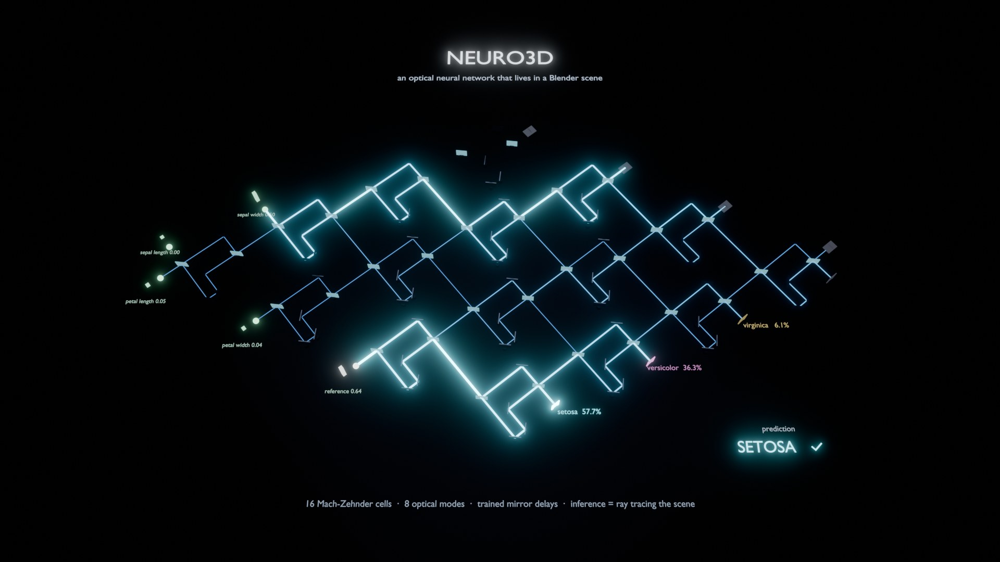
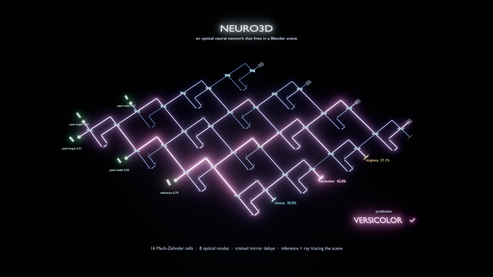
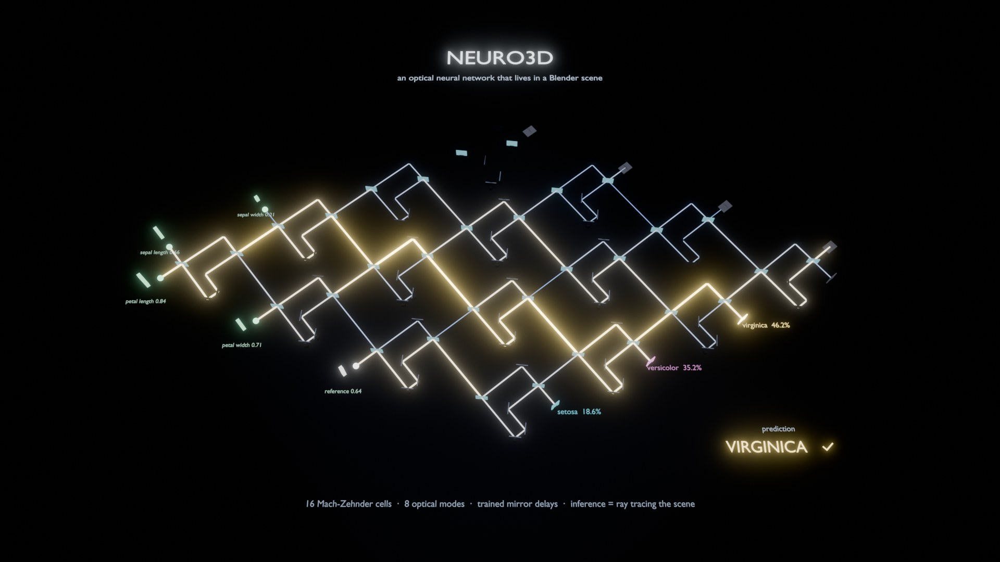

# Neuro3D · optical lattice classifier (Iris), living in a Blender scene



A small optical neural network whose computation is carried by a Blender scene. Inference
uses the **positions of 16 mirror delay lines** and a **trained reference-beam amplitude**
stored in the scene. Predictions come from **ray tracing the scene**. Training also fits a
loss temperature; argmax inference does not use that temperature.

| | |
|---|---|
| Network | 16 Mach–Zehnder cells (beam splitters, mirrors, one movable roof delay per cell) tiled on a 4 × 4 lattice, giving 8 optical modes |
| Task | Iris flowers (3 species), 4 features encoded as light amplitudes, plus one constant reference beam (an optical bias) |
| Decision | no trained read-out layer: the brightest of three class detectors wins (the detector intensities `abs(field)^2` and the argmax are computed in Blender's Python) |
| Training | inside Blender, numpy + Adam on 18 parameters (16 mirror delays, reference amplitude, temperature), about 36 s |
| Inference | `scene.ray_cast` from every source, splitting the ray tree at every beam splitter, then a coherent sum of `amp·e^{ikL}` at each detector |
| Hold-out accuracy (30 flowers) | **96.7 %** (train 97.5 %), measured by ray tracing the scene; the min/max scaling is fitted on the 120 training flowers only and stored with the weights |
| Scene vs. training model | all 8 complex outputs within 8.6e-5 across all 150 flowers; power balance within 6.4e-5; no escaped light; sample 71 complex fields unchanged after decoration and cold reopen |
| Cost | ≈ 56 000 ray casts and ≈ 2 s per flower on one CPU thread |

<p>
 
</p>

The beams are drawn with an emission proportional to the **coherent power** on each segment,
as computed by the ray tracer. The detector percentages are the measured detector powers.

## Run it

Headless (train, verify every flower by ray tracing, render three examples):

```bash
python run_blender.py "<path>/blender.exe" --train --verify --render renders
```

Live, in the Blender GUI:

```bash
blender renders/neuro3d_iris_lattice.blend --python neuro3d_iris_demo.py
```

The viewport opens in the camera view in rendered mode and the network **runs live**. Each
flower is ray-traced through the scene at that moment (about 2 s), the beams light up in
order of optical path length as the light propagates, and then the class detectors glow and
the prediction appears. The same *Play / Pause*, *Previous / Next* and *Build trained lattice*
controls are in **3D View › Sidebar (N) › Neuro3D**. Interactive **Build trained lattice**
creates a separate scene and preserves the current scene and unsaved objects.

Opening the `.blend` by itself does not run any code, because Blender does not auto-run scripts by
default and this project does not ask you to enable that. The script is embedded as the text
block `neuro3d_iris_demo.py`. To start the live demo from a fresh open, go to **Scripting ›
Text › neuro3d_iris_demo.py › Run Script**, or use the command line above. New exports include their data as embedded text blocks. Older exports require the data files
next to the `.blend` or in its parent folder.

Tested with Blender 4.5 LTS (EEVEE Next for the render, numpy bundled with Blender).

`--verify` writes a report and exits with failure when any residual is missing,
non-finite, negative, or above its explicit tolerance: power/model and complex
field/model 1e-3; decoration and save/reopen 1e-8; escaped power 1e-8;
power balance 2e-4. Reopened inference reads the actual scene reference amplitude.
Temporary saves use unique directories and are removed even on failure.

Newly exported `.blend` files embed the Python source, Iris CSV and trained state.
Move the `.blend` anywhere, open its embedded `neuro3d_iris_demo.py` in the Text
Editor and run it: the panel, live tracing and rebuild use the embedded assets.
Missing embedded assets fail explicitly. Older exports must be regenerated for
this portability behavior; simply opening a file does not automatically run code.

## Regenerated portable artifact (2026-10-06)

The distributed blend now contains the current source, CSV and trained state.
A separate Blender process verified all 150 flowers from a copy outside the
repository, with external asset reads blocked: 117/120 training and 29/30 test.
The [full report](portable_verification.json), [manifest](renders/portable_manifest.json)
and [method and limits](../../Docs/IRIS_PORTABLE_VALIDATION_2026-10-06.md) retain the evidence.

To export without training or rendering, run from this directory:

~~~bash
blender -b --factory-startup -t 1 --disable-autoexec --python-exit-code 1 --python export_portable_blender.py -- --output renders/neuro3d_iris_lattice.blend --manifest renders/portable_manifest.json
~~~

Copy only the blend and manifest outside the repository. Then run a fresh process:

~~~bash
blender -b --factory-startup -t 1 --disable-autoexec --python-exit-code 1 --python verify_portable_blender.py -- --blend /absolute/copied/scene.blend --manifest /absolute/copied/portable_manifest.json --report /absolute/copied/verification.json
~~~

The verifier executes the hash-checked embedded source, checks the panel's RNA
registration and compares eight complex fields and powers against the analytical
model. It includes missing embedded CSV/weights controls. Additional rejection
and stale-report controls are in test_portable_failure_blender.py, using the
same --blend/--manifest options plus --output-dir. Check the process exit code
and final verification_passed flag together; RUNNING/FAIL is not a successful run.
Interactive rebuilding with name collisions is a separate pending check.

## What is and is not claimed

* The scene **is** the network. Change a mirror and the prediction changes; the trained
  inference parameters are mirror positions and the scene reference amplitude.
* Blender's ray tracer supplies which optic each ray hits and the path lengths. The wave
  interference (complex amplitudes) is summed in Blender's Python from those lengths:
  Blender does not simulate wave optics. This is a **simulation** of a free-space optical
  network, not a physical photonic measurement, and it claims no speed or energy advantage.
* The lattice geometry and the ray-traced path sum were validated separately against two
  independent CPU oracles, with interventions, a sham control, an ablation, and save/reopen
  gates (project experiment EXP-004 conf1).
* Iris is a toy task. The hold-out set is fixed (seed 0) and was not used for training or
  for choosing restarts.

Files: `neuro3d_iris_demo.py` (scene, training, ray-traced inference, render, panel),
`trained_lattice.json` (trained mirror delays, reference amplitude and train-fit scaler), `scene_verification.json` (ray-traced
accuracy and model agreement), `iris.csv` (Fisher's Iris data, public domain).
