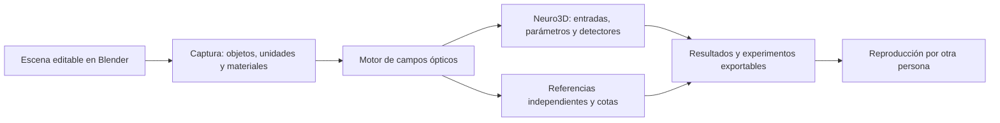

# Blender-Lab: objetivo, alcance y criterios de validación

El propietario concretó el 8 de octubre de 2026 dos objetivos conectados: conseguir una red neuronal que calcule dentro de Blender mediante un modelo de física óptica y convertir esa plataforma en **Blender-Lab**, un laboratorio de investigación abierto, reproducible y accesible. El instrumento computacional tiene valor y criterios de éxito propios, independientemente de fabricar un procesador fotónico.

Este documento define el producto y la investigación propuesta. **Blender-Lab todavía no es una distribución terminada ni validada.** Se conserva la [formulación anterior](CONTRIBUTION_AND_FALSIFICATION_2026-10-08.md) y sus recibos históricos. La ampliación queda registrada en [el contrato v2](research/contribution_contract_v2_blender_lab.json), sin alterar las preimágenes de v1 ni convertir datos históricos en ensayos nuevos.

## Aportación propuesta

Un entorno abierto en Blender para construir escenas ópticas, definir entradas y parámetros entrenables, calcular campos complejos y lecturas de detectores, ensayar redes y exportar experimentos reproducibles con límites de validez y error verificables.

Neuro3D será el demostrador de computación neuronal óptica del laboratorio. El cálculo debe depender de los objetos, sus posiciones y sus propiedades efectivamente utilizadas. Una modificación física pertinente debe modificar la salida prevista; mover objetos fuera del modo activo o aplicar un sham debe conservarla dentro de la cota declarada. Las pruebas deben distinguir errores del modelo, de representación, de recorrido, de aritmética y de entrenamiento.

La contribución de software se evaluará por utilidad, verificabilidad, acceso y reproducción. La contribución científica candidata es el método concreto que enlaza geometría real, caminos completos, campos coherentes y decisiones con cotas verificables. Su originalidad debe contrastarse con antecedentes específicos; el uso de Blender y la disponibilidad del código no bastan para afirmar prioridad histórica.

## Pregunta y refutación

**Pregunta:** ¿puede Blender-Lab permitir construir y ejecutar desde la escena real redes de óptica coherente, obteniendo resultados cuantitativos válidos y experimentos reproducibles, con certificados de error útiles y negativas explícitas cuando su modelo no sea suficiente?

Se conserva H1: cualquier resultado marcado `CERTIFIED` debe incluir la verdad del modelo representado en su intervalo de campo y derivar correctamente potencias y decisiones. Un contraejemplo verificado la refuta. La familia prospectiva debe incluir casos completos certificables: rechazar todos no demuestra utilidad.

Se añaden condiciones del instrumento, cada una con un resultado que la haría fallar:

| Condición | Qué la contradice |
|---|---|
| La escena determina el cómputo óptico | Una transformación pertinente no llega al solver o la salida procede de un operador ajeno a la escena sin equivalencia demostrada |
| El modelo produce interferencia cuantitativa | Desacuerdo fuera de cota con controles analíticos constructivos, destructivos y en cuadratura |
| La red realiza una tarea definida | Fallo del criterio de tarea fijado antes del test reservado, fuga de datos o parámetros que no corresponden al modelo óptico admitido |
| Un experimento puede repetirse | Otra ejecución con los mismos datos/entorno admitido no reproduce salidas dentro de cota y la diferencia queda sin explicación trazable |
| El flujo es utilizable y abierto | Instalación no reproducible, dependencia esencial no distribuible, unidades ambiguas o acciones de edición/guardado/exportación que cambian silenciosamente el experimento |

Los archivos, tolerancias, tareas, particiones y presupuestos de nuevos ensayos se fijarán tras completar la revisión pertinente y antes de recoger datos confirmatorios. Esta definición no emite un registro externo ni sustituye esa decisión pendiente.

## Arquitectura inicial

La primera implementación prevista será una extensión empaquetada de Blender, con motor científico modular y una colección de escenas de laboratorio. La distribución Blender-Lab reunirá estos componentes y un flujo único de trabajo. Cualquier cambio posterior al núcleo de Blender deberá responder a una limitación concreta comprobada.

| Componente | Criterio mínimo de cierre |
|---|---|
| Editor y captura | Objetos/triángulos/transformaciones/unidades/materiales/fuentes/detectores reales identificados y archivados; edición y reapertura conservan su significado |
| Motor coherente | Campos complejos, fases y ramas pertinentes; controles analíticos y adversos; régimen de validez explícito |
| Referencia y certificados | Oráculo independiente, error de representación/intersección/longitud/fase/suma/salida; incompletitud comunicada, sin convertir desconocidos en cero |
| GPU opcional | Misma semántica y criterios que la referencia; hardware/backend/readback documentados; NVIDIA y AMD sólo acreditados tras ejecución real |
| Red neuronal | Entradas, parámetros entrenables y detectores vinculados a la escena; entrenamiento y evaluación separados; test reservado y baselines de tarea equivalente |
| Laboratorio | Ejecución individual y barridos, cancelación/recuperación, datos crudos, scripts y gráficos regenerables |
| Distribución y acceso | Paquete instalable, dependencias/versiones declaradas, ejemplos pequeños ejecutables en CPU, documentación y código abiertos, entorno reproducible |
| Reproducción externa | Otra persona obtiene resultados cuantitativos equivalentes con las instrucciones publicadas; una autocopia del mismo proceso no cuenta como tercero |

El objetivo de acceso incluye una ruta de referencia CPU y ejemplos modestos; no debe exigir una GPU de gama alta para comprender, comprobar o editar un experimento básico. Los grandes barridos y benchmarks podrán declarar requisitos adicionales y su coste completo.

## Física y alcance de la primera versión

El dominio inicial es óptica escalar coherente con elementos y modos declarados, ramas completas y detectores cuantitativos. Se trabajará primero con interferómetros, divisor de haz, espejos, fuentes y detectores, y con la red Iris como caso histórico de partida. Se validará el significado de sus unidades y cuándo la aproximación por rayos es admisible.

Polarización, difracción, modos guiados, dispersión y no linealidades requieren módulos y validaciones propios. El laboratorio podrá incorporar referencias de ondas y datos experimentales publicados para contrastar su régimen. Mostrar una escena o un haz no prueba por sí solo la precisión de esa física.

La red Iris congelada tiene campos lineales en las entradas normalizadas y lectura cuadrática de intensidad; ese límite [ya está derivado](IRIS_LINEAR_FIELD_QUADRATIC_DECISION_2026-10-08.md). La ampliación a otras arquitecturas deberá identificar la no linealidad y sus ecuaciones. La cantidad de triángulos no mide la expresividad ni justifica una comparación con GPT.

## Antecedentes y comparación

El [pase específico de antecedentes Blender](BLENDER_LAB_ANTECEDENTS_2026-10-08.md) incorpora herramientas ópticas existentes y aplicaciones científicas publicadas. Se evaluarán como posibles comparadores o componentes interoperables. Sus prestaciones declaradas por autores se distinguen de lo que hayamos reproducido de forma independiente.

Para demostrar una diferencia relevante habrá que concretar qué experimento o garantía añade Blender-Lab, compararlo bajo entradas/salidas/modelo equivalentes y mostrar utilidad comprobable para otro investigador. La lista de funciones deseadas no es evidencia de una capacidad disponible.

## Prioridad y estado

Se conserva el orden autorizado: formulación ampliada → antecedentes y diferencia concreta → trazador/captura/cotas → red desde geometría → reproducción y experiencia de uso → capacidad/generalización/comparadores/coste → validación de régimen y réplica/publicación.

La fabricación y medición de un procesador fotónico quedan como línea opcional futura. Son necesarias si se reclama comportamiento o aprendizaje de un dispositivo físico; no son una condición para desarrollar y validar el instrumento computacional Blender-Lab.

Hay evidencia histórica de first-hit GPU y cálculo algebraico de la red; el [nuevo puente retrospectivo del plano racional](PLANNED_GEOMETRY_RETROSPECTIVE_LINKAGE_2026-10-08.md) no certifica captura Blender ni RT. La novedad específica, el trazador coherente completo desde triángulos, el paquete Blender-Lab y la reproducción externa continúan pendientes.
