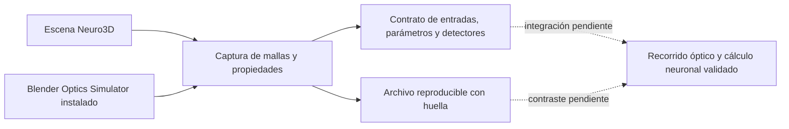

# Reutilización de bancos ópticos y captura de la red

El objetivo confirmado por el propietario es una **red neuronal funcional dentro de Blender**, cuyos resultados se obtengan mediante el modelo óptico de la escena. Blender-Lab será el instrumento abierto para construir, entrenar y estudiar esas redes. Los bancos ópticos existentes sirven como componentes y comparadores; la revisión de su novedad sigue abierta.

## Mejora implementada

Se añade un módulo de captura de la escena real, con un adaptador opcional para la interfaz de Blender Optics Simulator. Su función es registrar los datos que posteriormente utilizará y contrastará el motor neuronal:

- Matrices efectivas de las instancias del dependency graph, vértices locales de las mallas evaluadas, triángulos, modificadores aplicados y referencias de materiales.
- Unidades y escala, propiedades propias de Neuro3D y propiedades RNA ópticas, incluidos los puertos.
- Contrato explícito de entradas, parámetros y detectores: objetos identificados, orden de canales, direcciones de parámetros, unidades y límites.
- Lectura de los valores representados de los parámetros desde la captura, huellas SHA-256 y exportación a un archivo nuevo.

Los flotantes expuestos por `bpy` se escriben en representación hexadecimal, con ida y vuelta exacta. Esto evita **añadir** redondeo decimal; no recupera información que Blender ya haya cuantizado. Las matrices y vértices permanecen separados para no introducir una multiplicación de coordenadas sin presupuesto de error.



La captura y la resolución de direcciones están implementadas. Resolver esas direcciones no demuestra que un solver utilice los datos correctamente ni que la red aprenda. El enlace entre captura, recorrido coherente y tarea neuronal sigue siendo un trabajo científico pendiente.

## Qué aprovechamos de cada proyecto

| Proyecto | Uso decidido |
|---|---|
| [Blender Optics Simulator](https://github.com/emircbngl/blender-optics-simulator/tree/2b488e2e99dff4f56d67f57f9674bd00f812dda1) | Reutilizar su interfaz pública de banco óptico y sus convenciones explícitas de unidades como punto de interoperabilidad; registrar las propiedades RNA sin los redondeos de la exportación para inspección. El adaptador también permite recoger su `get_state()` de forma explícita como diagnóstico externo, sin convertirlo en certificado propio. |
| [BlenderPhotonics](https://github.com/NeuroJSON/BlenderPhotonics/tree/732799f9e3ebe10e013e316b8a21d88452755dc8) | Adoptar el flujo de laboratorio geometría → solver especializado → resultados cuantitativos y conservarlo como comparador de instrumentación. Su módulo Monte Carlo queda como candidato para transporte dispersivo; aún no se incorpora ni se presenta como sustituto de la propagación coherente neuronal. |

Se inspeccionaron código y licencias en los commits indicados. `get_state()` de Optics Simulator redondea centros, matrices y posiciones de puertos a seis decimales y normales a cuatro; por eso la captura científica lee directamente los valores representados por `bpy`. [Código primario de la interfaz](https://github.com/emircbngl/blender-optics-simulator/blob/2b488e2e99dff4f56d67f57f9674bd00f812dda1/optical_alignment_sim/optics_api.py).

Ambos repositorios declaran GPL-3.0. Los módulos nuevos son una implementación propia bajo la licencia MIT de Neuro3D; no se copian ni distribuyen sus fuentes. El programa externo debe instalarse por separado, con su licencia y atribución. El commit revisado se registra como referencia: no se da por verificada la versión instalada por el usuario.

## Uso

Desde un checkout de Neuro3D, para capturar un `.blend` sin ejecutar sus scripts embebidos ni el cálculo óptico:

```text
blender -b escena.blend --disable-autoexec --python-exit-code 3 --python Blender/blender_lab/export_scene_v1.py -- --output carpeta_existente/captura_nueva.json
```

Para vincular parámetros y canales, añadir `--network contrato.json`. Ejemplo de contrato mínimo de direcciones, que por sí mismo no es una red ejecutable:

```json
{
  "schema": "neuro3d.blender_lab.network_bindings.v1",
  "model": "identificador-del-modelo-optico",
  "inputs": [{"id": "x0", "object": "source"}],
  "parameters": [{"id": "delay0", "object": "mirror",
    "path": ["custom_properties", "delay"], "unit": "BU", "bounds": [0, 1]}],
  "detectors": [{"id": "y0", "object": "detector"}]
}
```

Los parámetros pueden dirigirse a `custom_properties`, a `optics` o a componentes de `matrix_world`. Un objeto vinculado debe tener una sola instancia evaluada; los objetos ausentes, excluidos o ambiguos y los valores fuera de límites se rechazan. La interpretación óptica del parámetro, las restricciones compartidas y sus gradientes corresponden al modelo y no se infieren del nombre del objeto.

Para la escena Iris histórica se publica [un contrato de direcciones](research/iris_scene_coordinate_bindings_v1.json): cinco entradas —incluida la referencia—, tres detectores de clase y 32 coordenadas de los dos espejos de cada uno de los 16 retardos. **32 direcciones no son 32 parámetros ópticos independientes.** Este contrato no redefine ni vuelve a entrenar la red, y no interpreta una coordenada absoluta como una fase sin su modelo geométrico.

También pueden resolverse esas direcciones sobre una captura existente, sin abrir Blender:

```text
python Tools/bind_network_capture_v1.py --capture captura.json --network Docs/research/iris_scene_coordinate_bindings_v1.json --output carpeta_existente/captura_vinculada_nueva.json
```

Con Optics Simulator activo dentro de Blender:

```python
from Blender.blender_lab.bos_adapter_v1 import capture_bos_scene
snapshot = capture_bos_scene(network=contrato)
```

`collect_bos_diagnostic()` es una llamada separada y explícita que sí solicita un trazado al programa externo. No se ejecutó en esta mejora. Para cualquier nuevo ensayo confirmatorio siguen vigentes el protocolo y la decisión pendiente sobre registro prospectivo.

## Alcance de la validación

Los controles de software verifican serialización, direcciones, límites, edición, mallas evaluadas, instancias de colecciones y conservación al guardar/reabrir en Blender 4.5.14 LTS. Se utiliza una fixture RNA propia compatible con los nombres inspeccionados; **no constituye ejecución ni validación independiente del addon externo completo**. Los recibos y preimágenes de cada intento se conservan en `Docs/validation/blender-lab-capture-2026-10-08/`.

Resultados de esta mejora:

- Once pruebas unitarias de admisión/integridad PASS, con fuente fijada.
- Fixture ejecutada realmente en Blender: puertos conservados, modificador recibido en la malla evaluada, instancias de colección identificadas, cambio de parámetro leído y misma huella al guardar/reabrir. Se ejercitaron rechazos por límites, detector ausente y parámetro excluido.
- Captura real de la escena Iris archivada: 462 objetos, 475 instancias evaluadas, 169 mallas únicas, 28.680 vértices y 34.280 triángulos en esas mallas únicas. Incluye la decoración y el contexto de la vista activa; no demuestra que toda esa geometría participe en el cálculo neuronal.
- Resolución posterior del contrato Iris sobre esos datos: cinco entradas, 32 coordenadas y tres detectores, sin nuevo trazado óptico. El recibo declara expresamente `AFTER_CAPTURE_FROM_SNAPSHOT`.

Un intento de captura adicional fue detenido antes de lanzar Blender por el umbral de RAM libre; se conservó el rechazo y no se redujo el guard. Las comprobaciones ejecutadas utilizaron un solo hilo, sin GPU, con timeout y límites de memoria. Sus tiempos son costes de comprobación de software, no benchmarks de inferencia.

Las preimágenes distinguen las revisiones ejecutadas. Los reintentos anteriores sin RAM permanecen archivados como no ejecutados. Al reanudar, la fuente vigente se ejecutó realmente en Blender: se ejercitaron las negativas tanto de objetos como de instancias enlazadas de otra biblioteca, incluyendo colisión de nombres con un objeto local. Se conservó también la identidad al guardar/reabrir.

La CLI de captura con el contrato Iris se ejecutó directamente en Blender y obtuvo la misma huella de estado que la resolución previa sobre el archivo exportado: `8624d661252f143653f5b32c744cb7e6b23f71119253d7ad64510bbf1aa1a943`. Es equivalencia de datos y direcciones, sin cálculo óptico ni entrenamiento nuevos. [Recibos y preimágenes de la reanudación](validation/blender-lab-capture-2026-10-08/resume01/artifact_index.json).

Comprobaciones de software regenerables:

```text
python -m unittest Blender.tests.test_blender_lab_capture_v1 -v
blender -b --factory-startup --disable-autoexec -t 1 --python-exit-code 3 --python Blender/tests/blender_lab_capture_smoke_v1.py -- carpeta_existente_sin_resultados
```

Las geometrías no mesh se enumeran, pero no se convierten ni se certifican. Las referencias de materiales de render no se interpretan como modelos ópticos. Los objetos enlazados de otra biblioteca requieren un adaptador de identidad explícito. Una huella prueba integridad del contenido, no precisión física, completitud de caminos ni autenticidad del productor.

Esta mejora no cierra los puntos de novedad, trazador RT, presupuesto nativo completo ni red neuronal desde triángulos. No recoge nuevas salidas ópticas, entrenamiento, generalización o GPU. Es una pieza verificable para conectar los bancos disponibles con el objetivo neuronal.
