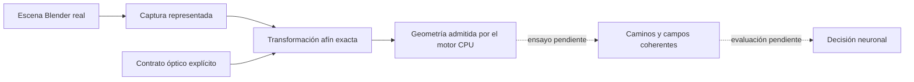

# Captura real → entrada óptica y cobertura de abanicos

Se añade un adaptador entre la captura Blender y el formato del motor escalar CPU existente. Conserva los triángulos evaluados y transforma sus vértices mediante aritmética racional exacta sobre los valores representados. Una captura requiere un contrato explícito de colección, roles, fuentes, longitud de onda, coeficientes y modos; la apariencia del material no determina esos parámetros.

## Resultado de la preparación

La escena Iris capturada directamente en Blender se convirtió en una entrada admitida estructuralmente: **104 elementos ópticos, 6.656 triángulos y cinco fuentes**. Incluye los ocho detectores ópticos; el contrato neuronal identifica tres de ellos como salidas de clase. Un auditor independiente, sin importar el productor, verificó los índices de triángulos, los coeficientes declarados y **20.280 coordenadas mundiales** correspondientes a 6.760 vértices. Dos controles alterados —coordenada y afirmación falsa de certificación— fueron rechazados.



La transformación exacta define el modelo afín de los valores capturados; **no reproduce los redondeos internos de Blender o de un backend GPU**. El presupuesto de ejecución nativa permanece pendiente. El contrato usa λ=0,1 BU, divisores 50/50 y espejos con coeficiente −1 y fase adicional declarada cero, como modelo escalar explícito. Esas declaraciones no son mediciones de componentes físicos.

Las posiciones de las fuentes se leen de sus instancias evaluadas. Difieren de los descriptores JSON del demostrador anterior hasta `107803679/281474976710656` BU, aproximadamente `3,82995605e-7` BU. Se conserva esta diferencia, sin convertirla en una cota completa de longitud, fase o campo. La preparación no garantiza equivalencia con el trazado anterior que utilizaba aquellos descriptores.

## Corrección del selector de superficies

El selector anterior admitía interiores de un triángulo y algunas costuras de dos triángulos. Rechazaba un vértice central compartido por un abanico aunque la unión cubriera una vecindad completa. En la primera consulta geométrica de la fuente `r0` de la captura Iris, **64 triángulos coinciden en el centro de `c00.bs1`**: el código anterior devuelve `BOUNDARY`; el actualizado devuelve `SELECT`. Es una regresión de software sobre geometría afín representada, sin nuevos campos ópticos ni ejecución GPU.


La figura ilustra el predicado y sus controles, no una simulación de campos.

### Justificación matemática

Para cada triángulo coplanar incidente y cada arista, se escribe su desigualdad interior como `a + L(δ) ≥ 0`, donde δ pertenece al plano de incidencia y `a ≥ 0` en el punto considerado. Las restricciones activas tienen `a=0`; las inactivas tienen holgura positiva.

1. Las restricciones activas definen el cono de direcciones local de cada triángulo. Las rectas de sus bordes se proyectan a dos coordenadas del plano y se ordenan con signos y determinantes racionales; no se calculan ángulos flotantes.
2. Entre dos direcciones consecutivas, todos los signos de las restricciones activas son constantes. Un representante racional interior permite comprobar si algún cono cubre esa celda angular. Las direcciones de borde pertenecen a la unión cerrada de los conos.
3. Si se cubren todas las celdas, se cubren todas las direcciones del plano. Hay un radio positivo común en el que las restricciones inactivas siguen satisfechas: son finitas y tienen holgura estrictamente positiva. La unión contiene por tanto una vecindad abierta del punto.
4. Si una celda queda descubierta, existen puntos arbitrariamente próximos fuera de la unión. El punto sigue siendo borde. Un sector omitido de anchura definida por `2^-100` conserva este resultado en el control exacto.

La prueba sólo se aplica después de exigir el mismo objeto y normales coplanares paralelas. Elegir una de las primitivas coincidentes conserva el plano, punto, reflexión y parámetros ópticos del objeto: `d − 2n(d·n)/(n·n)` no cambia al escalar o invertir n. La exclusión posterior exige contacto con ese mismo plano. No se fusionan caminos ni se descartan contribuciones.

Se mantienen como no resueltos los empates entre objetos, bordes exteriores, huecos y pliegues no coplanares. Se añadieron ocho controles exactos de unión y se conservó el resultado de los 17 tests históricos del motor, incluidos contactos, retornos, huecos y propagación de sus fixtures anteriores. Los 13 controles del nuevo adaptador también pasan.

## Código y reproducción

- [Adaptador de entrada](../Blender/blender_lab/scalar_scene_ingress_v1.py).
- [Preparación de archivo](../Tools/prepare_captured_scalar_scene_v1.py).
- [Auditor independiente](../Tools/audit_captured_scalar_ingress_v1.py).
- [Selector CPU actualizado](../Blender/benchmarks/capacity_audit/robust_multipath_v1.py).

```text
python Tools/prepare_captured_scalar_scene_v1.py --capture captura.json --semantics semantica.json --fields campos_de_entrada.json --out escena_nueva.json
python Tools/audit_captured_scalar_ingress_v1.py --capture captura.json --scene escena_nueva.json --semantics semantica.json --fields campos_de_entrada.json --out auditoria_nueva.json
python -m unittest Blender.tests.test_scalar_scene_ingress_v1 Blender.tests.test_surface_union_interior_v1 -v
python Blender/tests/test_robust_multipath_v1.py -v
```

Los campos del archivo de entrada son estímulos declarados para admisión; aún no son salidas calculadas. El contrato inicial admite una colección plana de superficies y una instancia activa por elemento. Los roles ópticos activos fuera de ella, geometría desconocida, parámetros omitidos, referencias inconsistentes y datos no finitos se rechazan.

La entrada y las fuentes fijadas están en [los recibos de esta etapa](validation/captured-scalar-ingress-2026-10-08/artifact_index.json). Esta etapa no cierra novedad, propagación completa de Iris, error nativo, entrenamiento ni GPU. Los ensayos confirmatorios nuevos requieren resolver el registro prospectivo indicado en el checkpoint.

Se prepara además [un protocolo concreto del próximo piloto](validation/captured-scalar-ingress-2026-10-08/pilot_protocol_prepared.json), con entradas y fuentes archivadas, criterio binario de completitud, límites de recursos y tratamiento de resultados incompletos. Está **preparado y no ejecutado**; carece de registro externo/IPFS y no declara aprobado un reemplazo por GitHub. El piloto sólo evaluaría viabilidad del recorrido, sin confirmar H1 ni precisión física/neuronal.
