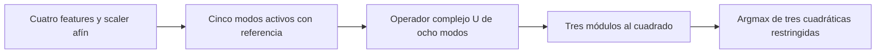

# Qué función implementa el circuito Iris congelado

Análisis matemático del modelo ya existente, usado para delimitar la novedad frente a los antecedentes. **No es un nuevo entrenamiento, test, experimento GPU ni resultado confirmatorio de H1.** La identidad es conocida en óptica lineal y álgebra; no se reivindica como descubrimiento.

## Alcance verificado en el código

El auditor independiente `Blender/tests/audit_iris_native_circuit_v1.py` usa el scaler afín de cuatro features, campos de entrada `(x0,x1,0,0,x2,x3,r,0)` divididos por su norma, un operador complejo8×8 y logits `exp(logt)*intensity[i]` para i=0,1,2. La clase elige la mayor de esas tres intensidades; no hay pooling de pares de detectores en este contrato. Se analiza esa ruta canónica congelada, no todos los otros modelos históricos del repositorio.

## Derivación para parámetros fijos

Sean x∈R⁴ las features después del scaler, r>0 la referencia entrenada, y U el operador complejo del circuito para geometría/fases fijas. Escribimos s(x) = Bx + r e6, donde B selecciona los modos 0,1,4,5. El campo de salida es

E(x)=U s(x)/sqrt(Q(x)), con Q(x)=xᵀx+r²>0.

Para cada detector de clasificación c∈{0,1,2}, definimos a_c como los cuatro elementos de la fila c de U en esos modos y b_c = r U_c6. Entonces

I_c(x)=|a_c·x+b_c|²/Q(x), y logit_c(x)=gI_c(x), con g=exp(logt)>0.

El factor positivo común g/Q(x)no cambia **el conjunto de máximos**, incluidos empates. Por tanto, la decisión exacta es

argmax_c q_c(x), donde q_c(x)=|a_c·x+b_c|².

Si a_c = u_c + i v_c y b_c = b_R+ib_I, se obtiene por expansión

q_c(x)=xᵀ(u_cu_cᵀ+v_cv_cᵀ)x+2(b_Ru_c+b_Iv_c)·x+b_R²+b_I².

Cada matriz cuadrática es semidefinida positiva y tiene rango ≤2 sobre R⁴. Las fronteras entre clases son q_c−q_d=0, de grado≤2; el scaler afín de las variables originales conserva ese grado. Las fases/topología imponen restricciones adicionales sobre los coeficientes alcanzables. La derivación no demuestra que la arquitectura pueda realizar cualquier conjunto de cuadráticas.

## Consecuencias para comparación y novedad

- El circuito tiene lectura no lineal por intensidad, pero no una sucesión de activaciones no lineales entre sus 16 celdas. Para parámetros fijos, su campo es lineal en los campos de entrada y su decisión pertenece a esta familia cuadrática restringida.
- Aumentar caminos o triángulos que sólo representan el mismo U no cambia esta función. Aumentar fases entrenables o cambiar conexiones puede ampliar la familia realizable; eso debe medirse y caracterizarse.
- El gaincomún y la normalización afectan logits/probabilidades, sensibilidad numérica y entrenamiento, aunque no cambien el argmax exacto de un estado fijo. Variar el gain durante entrenamiento puede cambiar la trayectoria de optimización y los parámetros finales.
- Esta reducción da un baseline adicional pertinente: evaluación afín compleja seguida de módulo al cuadrado, además del operador matricial/circuito. Para comparar tareas y costes se conserva la precisión, los coeficientes y la preparación deU, y se cuenta cualquier actualización geométrica.
- Ninguno de estos hechos demuestra una ventaja sobre CNN/GPT ni una limitación de futuras rutas con otras codificaciones, no linealidades intermedias o recurrencias. La aritmética nativa aproximada puede cambiar una decisión cerca de una frontera; falta su certificado completo.

La prueba general es la expansión anterior. Un [recibo CPU exacto](validation/quadratic-readout-2026-10-08/attempt01/receipt.json) aporta 81 entradas racionales y cuatro controles de gainpositivo para detectar errores de implementación de la identidad, con matrices de rango2. Los 81 testigos no sustituyen la prueba general ni son81muestras nuevas de generalización.

El nuevo punto 12 de capacidad continúa abierto para el resto de arquitecturas/límites. Este análisis se publica como contraste de la revisión del punto 1, que continúa abierto para demostrar originalidad de una aportación concreta.
