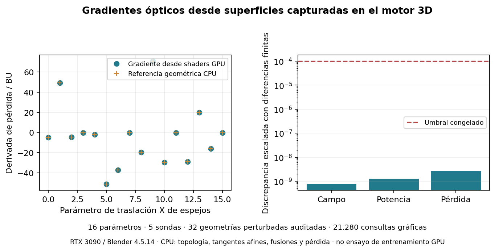

# Native graphics optical derivatives from captured geometry

This new bounded trial is frozen and published on main before execution under the explicit continuing GitHub authorization. External/IPFS registration remains pending. Native Blender 4.5.14 and the fixed RTX 3090 execute under the shared GPU FIFO.

The shader derives the intersection parameter and its translation derivative from captured plane normals, offsets, object displacement tangents and current ray origins/directions. It derives phase and complex-field derivatives through propagation, splitter/mirror branching and terminal reference phase in FP64. Incoming fields and tangents are supplied by explicit CPU compensated coherent accumulation, not a precomputed optical matrix. Exact CPU affine origin/displacement tangents and topology admission are declared parts of this hybrid model. Power differentiation and cross-entropy chain rule remain CPU.

Each selected surface is checked against the independently admitted graph. Two actual draws verify bit-exact incoming field and derivative echoes, with identical selected geometry. Five probes are fixed: native Iris rows 0, 74, 149; a declared bounded complex input; and zero input. All16 paired-mirror world-X parameters are differentiated. Field agreement remains 1e-11, field/power Jacobian absolute agreement 1e-9, loss-gradient agreement 1e-8. A separately evaluated central finite difference at 1e-7 BU must agree within 1e-4 scaled discrepancy; all32 perturbed represented geometries receive independent full neighbourhood/nearest/branch audits. Zero input must have exactly zero field/power geometry gradients.

The five probe labels define a diagnostic loss, not a new classifier training or generalization experiment. CPU finite differences use exact virtual materialized geometry, not fresh native Blender saves at each offset. These numerical controls do not rigorously enclose every unobserved derivative or physical optical model. No GPU training claim follows from a derivative test.

Resources:480seconds, oneCPUcore, free RAM4,000MiB/floor2,500MiB, ownedRSS2,000MiB/evidence128MiB; sampled GPUmemory2,048MiB/temperature80C. Failure or deadline gives no accepted gradient result; original trials and thresholds are retained.

[Profile](research/native_graphics_gradient_profile_2026-10-09.json), [registration](research/native_graphics_gradient_registration_2026-10-09.json), [previous verified graphical fields](NATIVE_GRAPHICS_COHERENT_FIELD_PROTOCOL_2026-10-09.md), [independent observed field certificates](NATIVE_GRAPHICS_FIELD_CERTIFICATE_PROTOCOL_2026-10-09.md).

## Result: native captured-surface optical derivatives pass

Frozen main and scientific branch `699f01e3017e7fffcd455fa7ed999eafc03127fb`, profile SHA `666feb78fc42a226c3c35aeea89d9182d0bfbcde68f2659c05f730e369c77e52`, 88 pinned files. Publication and source bytes were verified before the shared FIFO trial. Actual RTX 3090/OpenGL 4.6 and Blender 4.5.14 execute all16 parameter tangents through captured triangle selection and FP64 ray-plane/phase/branch/terminal transport; no precomputed transfer or optical Jacobian matrix supplies the shader.

All five declared probes and16 parameters pass the unchanged gates. Maximum observed field discrepancy is **6.577202977108473e-14**, complex-field Jacobian discrepancy **5.735206773917134e-12**, power-Jacobian discrepancy **9.277023593767808e-13**, and diagnostic loss-gradient discrepancy **5.432099214885966e-12**. Field values are exactly equal across the16 parameter passes. The zero-input field/power gradients are exactly zero. All **8084** owned GL stages have no errors, and both value and tangent input echoes preserve binary64 bits.

Thirty-two independently audited exact virtual perturbed geometries supply central finite differences at1e-7 BU. Maximum scaled discrepancies are **7.468439523058658e-10** for field, **1.283015249597952e-09** for power and **2.65879495464918e-09** for loss, below1e-4. These are independent materialized geometric controls, not32 fresh native Blender saves or rigorous universal derivative intervals. The five-probe diagnostic labels do not define new classification/generalization evidence.

The16 graphical passes perform21,280 geometric queries including echo draws and cost 14.857720 s in total. Independent finite-difference geometry audits cost 296.745830 s. The full supervised worker costs **336.924254 s**, peak owned RSS **434.86 MiB**. Exact CPU topology, affine origin/displacement tangents, compensated field/tangent merging and power/loss chain rule remain explicit. No complete GPU training, hardware RT, AMD, energy, physical-fidelity or equivalent-speed advantage is demonstrated by this gradient audit.

[Evidence index](validation/native-graphics-gradients-2026-10-09/attempt01/evidence_index.json), [result](validation/native-graphics-gradients-2026-10-09/attempt01/worker/result.json), [supervision](validation/native-graphics-gradients-2026-10-09/attempt01/supervisor.json).

