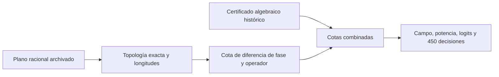

# Del plano racional al certificado de salidas históricas

Este análisis retrospectivo cierra una diferencia **matemática del plano racional archivado**. No ejecuta la GPU, no captura una escena Blender y no acredita recorrido nativo de triángulos, dispositivo físico, novedad ni H1 confirmada. Depende del [certificado algebraico anterior](IRIS_RETROSPECTIVE_RATIONAL_CERTIFICATE_2026-10-08.md), identificado por SHA256; las salidas históricas permanecen intactas.

## Diferencia entre modelos

El plano desplazó dos espejos de cada interferómetro en `d = theta * lambda / (4*pi_f)`, con `pi_f` igual al binary64 archivado de π. La referencia algebraica añade directamente `theta` a la fase del brazo largo. Si la propagación usa el π matemático, ambos modelos difieren.

Las direcciones son cardinales y unitarias. En coordenadas locales, el brazo largo recorre `(0,0) → (2+d,0) → (2+d,1/2) → (1,1/2) → (1,2)`. Sus segmentos positivos suman `L_long = 5+2d`. El corto recorre `(0,0) → (0,2) → (1,2)` y suma `L_short = 3`. Por tanto,

```text
k L_long = k*5 + theta*(pi/pi_f),    k = 2*pi/lambda
delta_phase = theta*(pi/pi_f - 1).
```

Aquí `lambda` y `theta` son los valores racionales de los bits archivados. La longitud está en unidades Blender del plano, no en metros medidos. Las dos reflexiones adicionales del brazo largo conservan la convención de campo del circuito: tres espejos frente a uno producen el mismo signo negativo. Con amplitudes `T=1/sqrt(2)` y `R=i/sqrt(2)` en ambos divisores,

```text
U_cell = [ -i(e_long+e_short)/2,   (e_long-e_short)/2 ]
         [  -(e_long-e_short)/2, -i(e_long+e_short)/2 ].
```

Las fases de entrada, enlaces y salida son las mismas en ambos modelos. Sólo cambia la fase del brazo largo. Esta equivalencia depende de comprobar también los enlaces y las convenciones de cada arista, no sólo de sumar longitudes.

## Comprobación de la topología archivada

El [nuevo verificador](../Tools/certify_planned_geometry_linkage_v1.py) no importa el generador de geometría, el selector previo de triángulos, mpmath ni el auditor numérico. Lee los archivos archivados y comprueba por separado:

- Los 104 objetos, 208 triángulos, coordenadas racionales, materiales, ocho fuentes y ocho detectores, vinculados al mismo estado entrenado que la ejecución histórica.
- Los 136 estados de cada caso baseline/phase mediante intersección exacta del plano y pertenencia por semiplanos. Revisa todos los triángulos para cada estado, sin epsilon ni poda.
- El único contacto excluido es la salida desde el mismo plano óptico anterior. Las dos coincidencias aceptadas son la costura interior del mismo cuadrilátero, con impacto en su centro. Un encuentro coplanar real queda fuera del dominio y se rechaza.
- Todas las ramas, sus amplitudes/fases, reflexiones, destinos locales y enlaces entre celdas. No hay estados duplicados, huérfanos, caminos descartados ni ciclos. Se verifica el orden del grafo.

La superposición de campos permite usar el mismo grafo para cualquier combinación de sus ocho fuentes. La reducción identifica estados con idéntico punto, dirección, plano anterior y operador futuro; no suma intensidades en lugar de campos. La comprobación es sobre estos planos completos archivados, no sobre geometría desconocida o aproximada.

## Cota hasta campo, intensidad y decisión

Cada celda ideal es unitaria: dos divisores unitarios, propagaciones de módulo uno y reflexiones de módulo uno. Su cambio de operador satisface `||ΔU_cell||₂ ≤ |delta_phase|`, porque `|exp(i*a)-exp(i*b)| ≤ |a-b|` y los cambios de base unitarios conservan la norma. La serialización de las 16 celdas y sus enlaces es un producto de operadores unitarios embebidos en ocho modos. Una suma telescópica da

```text
B = ||U_plano - U_algebra||₂
  ≤ sum_c |theta_c| * |pi/pi_f - 1|.
```

No aparece un factor exponencial por contar caminos. Para la entrada normalizada exacta, la diferencia de cada campo complejo en norma L1 de sus componentes real/imaginaria es ≤`sqrt(2)*B`. La diferencia de potencia por puerto es ≤`2B+B²`; se usa `|campo_algebra|≤1`. La cota de logit multiplica esa expresión por una cota superior racional de `exp(logt)`.

La implementación encierra π con Machin y restos alternantes a resolución outward de 256 bits. La exponencial del gain usa Taylor positiva con una cola geométrica explícita. Estos principios son conocidos; este trabajo documenta su aplicación y sus precondiciones, sin reivindicar descubrimiento matemático.

Para cada fila se resta dos veces la cota de logit a la separación inferior de la clase ganadora respecto a las otras dos. Una separación residual positiva certifica la misma decisión para el plano racional. Se añaden las cotas del puente a las cotas del certificado algebraico ya publicado.

| Resultado retrospectivo | Cota superior para el plano racional |
|---|---:|
| Campo, L1 por componente complejo | ≤ 1,304 × 10⁻¹³ |
| Potencia por puerto | ≤ 3,627 × 10⁻¹⁴ |
| Logit | ≤ 3,563 × 10⁻¹² |
| Decisiones certificadas | 450/450 |

Son 150 filas × baseline/phase/sham ya ejecutadas; no son 450 etiquetas acertadas ni tres réplicas independientes. Sham comparte el mismo plano baseline porque sus parámetros archivados son iguales. Se conservan los límites históricos de utilidad, sin ajustarlos después de observar estas cotas.



## Reproducción y límite restante

```powershell
python -X utf8 Tools/certify_planned_geometry_linkage_v1.py --output Docs/validation/planned-geometry-linkage-2026-10-08/reproduction-fresh
```

El directorio debe ser nuevo. [Attempt02](validation/planned-geometry-linkage-2026-10-08/attempt02/receipt.json) conserva fracciones completas, separaciones de las 450 filas, hashes y preimágenes del verificador. [Los controles analíticos](research/planned_geometry_math_controls_v1.json) cubren intersecciones, paralelismo, coplanaridad, degeneración, reflexiones, identidad longitud/fase y la exponencial.

Attempt01 se conserva como rechazo del primer verificador: éste rechazaba incluso una coincidencia con el **plano infinito** de un triángulo que el rayo no alcanzaba. La revisión recorta el rayo contra el triángulo finito y sigue rechazando cualquier encuentro coplanar real. Ese intento no fue una ejecución GPU ni un fallo demostrado del plano.

Para cerrar la ruta Blender faltan las coordenadas efectivamente almacenadas, transformaciones, cuantización, intersecciones y longitudes del backend nativo, todas sus ramas y readbacks. El [testigo de pérdida de información por cuantización](QUANTIZATION_INFORMATION_LOSS_WITNESS_2026-10-08.md) impide asumir que una escena cuantizada equivale automáticamente al diseño original. Los puntos 1 de novedad y 2–19 permanecen abiertos.
