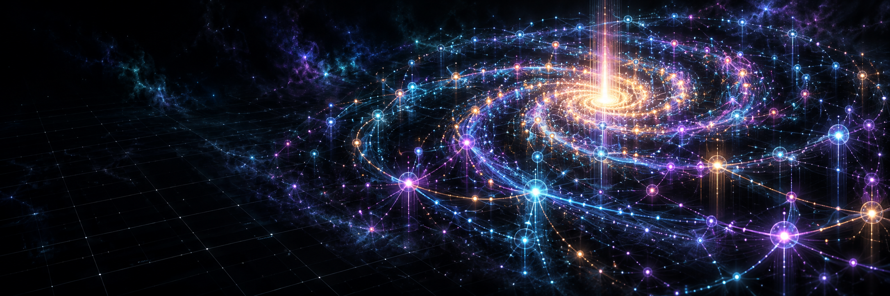
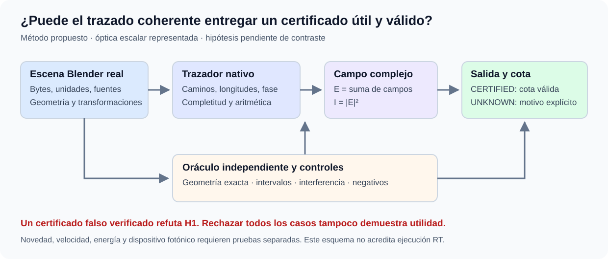
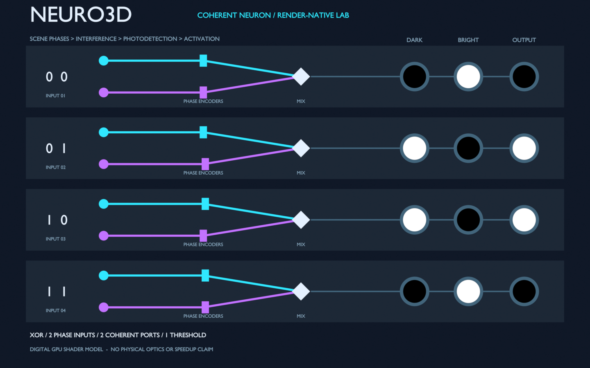
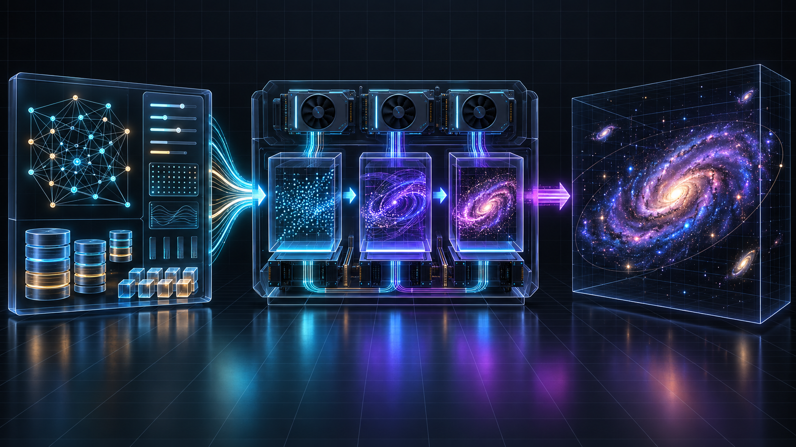
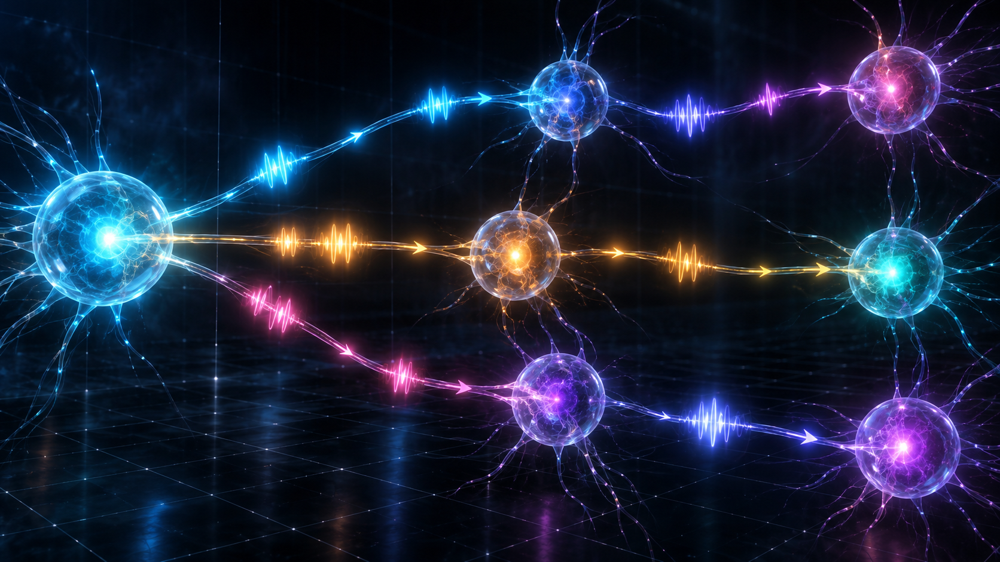
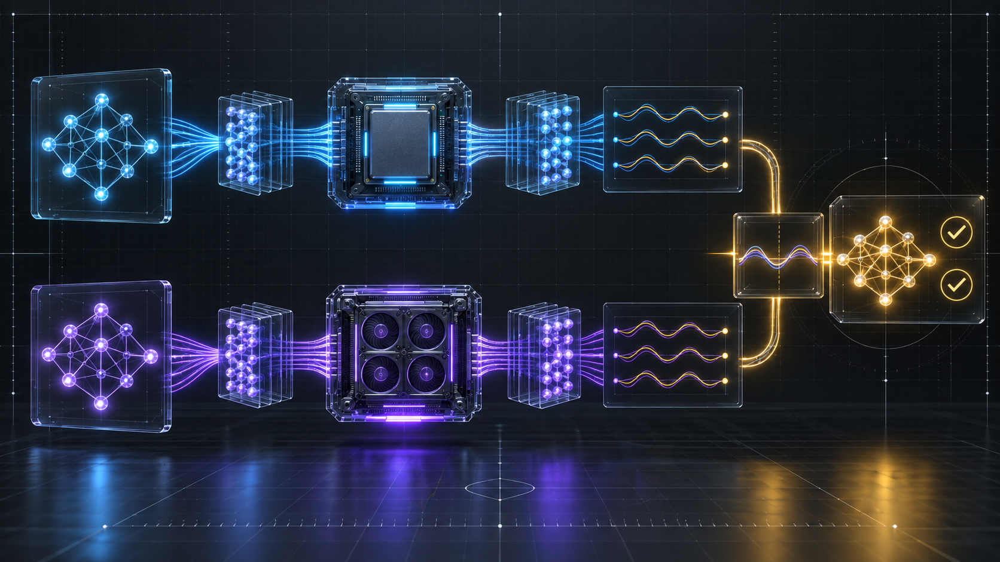

# Neuro3D



> Arquitectura experimental en la que la geometría 3D y las propiedades ópticas de la escena determinan la propagación y transformación de señales entre neuronas. La apariencia visual es secundaria al cómputo.


## Estado consolidado

La agenda científica del 8 de octubre utiliza Blender como laboratorio principal;
Unreal queda como referencia histórica por decisión del propietario.
Consulta [los cierres y su alcance](Docs/SCIENTIFIC_CLOSURE_STATUS_2026-10-08.md),
el [plan completo](Docs/BLENDER_SCIENTIFIC_ROADMAP_2026-10-08.md) y la
[nueva secuencia de investigación](Docs/SEQUENTIAL_RESEARCH_PROGRESS_2026-10-08.md).

## Pregunta científica y progreso verificable



Se ha [formulado la aportación candidata](Docs/CONTRIBUTION_AND_FALSIFICATION_2026-10-08.md):
transporte coherente desde geometría real con certificados de error utilizables.
Un certificado falso verificado refutaría la hipótesis; rechazar todos los casos
no demostraría utilidad. La novedad y la ejecución RT completa permanecen pendientes.
El esquema muestra el método propuesto, no un resultado experimental.

Los cierres anteriores incluyen 20 consultas first-hit GPU, referencia multicamino
CPU exacta/certificada y el circuito Iris completo en GPU con 450 acuerdos con
la referencia independiente. Los 450 acuerdos no son 450 clasificaciones correctas;
el test histórico conserva 29/30. No acreditan recorrido completo de triángulos RT,
generalización nueva, ventaja energética ni un dispositivo fotónico físico.

## Consolidación histórica

La integración del 6 de octubre reúne los avances locales del motor y las
correcciones públicas de Iris. Consulta el [estado técnico y sus límites](Docs/PROJECT_STATUS_2026-10-06.md)
y el [recibo de consolidación](Docs/validation/consolidation-2026-10-06.json).

## Qué es

Neuro3D explora una red neuronal digital donde posición, orientación y respuesta
óptica de los objetos determinan la información que recibe cada neurona. El
primer circuito usa óptica geométrica simulada en CPU y mide intensidad, color,
frecuencia y fase. La ambición posterior es escalarlo y aprovechar la GPU, sin
confundir este prototipo con hardware fotónico real o un solucionador de Maxwell.

## Demostrador ejecutable dentro de Blender



Abre [Neuro3D_Render_Network.blend](Blender/render_network_demo/Neuro3D_Render_Network.blend)
en Blender 4.5 y pulsa **F12**. Sus nodos de material calculan interferencia,
fotodetección y activación durante el render EEVEE; Python no suma campos durante
esa inferencia. Las posiciones X de los codificadores y las propiedades de escena
controlan fase, longitud de onda, potencia y umbral. Cuatro copias de una neurona
coherente mínima muestran XOR, con una presentación lista para inspeccionar.

Es un **modelo digital ideal de shader con offsets simbólicos**, no una red
entrenada general, trazado geométrico de esos haces ni computación óptica física.
Los drivers suministran parámetros desde CPU y el render sigue haciendo aritmética.
No hay ventaja de velocidad o eficiencia demostrada. Pruebas por readback EXR,
instrucciones y límites en [la guía del demostrador](Blender/render_network_demo/README.md).

## Rutas de implementación

La reconstrucción actual contiene:

- **Oracle CPU**: referencia determinista, reproducible y ejecutable sin GPU.
- **Blender**: gates híbridos de raycast y campos, más el demostrador EEVEE
  ejecutado en GPU. La vista previa CPU y el contrato GPU antiguo se conservan.
- **Unreal Engine histórico**: plugin `SantoGrialPhotonic` con ciclo RDG y compute
  shaders preservado; su compilación no está acreditada y ya no es requisito.

## Vista de arquitectura



En el nuevo circuito Blender, los objetos de la escena son la fuente de verdad:
sus transformaciones y propiedades ópticas alimentan el trazado, y el resultado
se escribe en el receptor. Lee [la arquitectura óptica](Docs/BLENDER_ARCHITECTURE.md)
para las ecuaciones, el alcance físico y los límites actuales.

## Cómo viaja una señal



Cada arista tiene origen, destino, peso y retardo. La señal conserva una fase y una
frecuencia, transporta color RGB y pierde amplitud mediante atenuación. La
acumulación coherente modifica la activación, energía, fase y color del nodo destino.

## Validación



La GPU no se considera validada por compilar un shader: debe producir un readback
comparable con el oracle CPU, con error por campo, checksum y métricas de latencia.

## Inicio rápido sin ocupar la GPU

Desde la raíz del repositorio:

```powershell
python Blender/tests/test_photonic_model.py
python Blender/tests/test_scene_optics.py
python Blender/tests/test_static_contract.py
```

Estas pruebas no importan `bpy`, no inicializan un contexto GPU, no lanzan Blender y
no ejecutan shaders.

## Versión Blender

Consulta [Blender/README.md](Blender/README.md) y el [plan completo de pruebas](Docs/BLENDER_TEST_PLAN.md).

El addon original sigue siendo un circuito CPU; la demo EEVEE anterior es una
ruta separada, ahora ejecutada y verificada. El addon crea
un circuito de tres objetos y calcula un pulso óptico con un rayo reflejado en
CPU. El circuito se ejecutó realmente en Blender 4.5.14 LTS en background, se
guardó y se reabrió con el mismo estado. Consulta el
[informe de ejecución](Docs/BLENDER_RUNTIME_REPORT.md). La antigua vista previa
visual se conserva aparte. El shader experimental está en
`Blender/shaders/nebula_photonic_compute.glsl`.

Las validaciones posteriores de una celda y una malla de 16 interferómetros
(8 modos) superaron gates locales híbridos: Blender determina geometría y
longitudes por raycast, mientras Python suma los campos complejos. El fallo
histórico de referencia de fase y el primer fixture multicelda fallido se
conservan en el historial, sin convertirlos retrospectivamente en éxitos.
Consulta [la auditoría independiente de EXP-004 conf1](Docs/EXP-004-CONF1-INDEPENDENT-AUDIT-2026-09-29.md).
Estos gates no validan óptica física ni el transporte geométrico del nuevo shader.

## Versión Unreal Engine histórica

Ruta preservada para trazabilidad; retirada de los requisitos por el propietario.
Las decisiones del plugin descritas debajo pertenecen a esa ruta histórica.

El plugin está en `Plugins/SantoGrialPhotonic`. Implementa una primera rebanada
vertical con:

1. `EmitSignalsCS`.
2. `AccumulateFieldsCS`.
3. `UpdateNeuronsCS`.
4. Readback periódico para checksum y energía.

Lee [las decisiones de reconstrucción](Plugins/SantoGrialPhotonic/Docs/DECISIONS.md)
antes de modificar el pipeline. No se debe añadir OptiX ni convertir Niagara en el
núcleo computacional antes de pasar compilación UE, readback y paridad.

## Versiones antiguas y compatibilidad

Las fuentes y documentos previos se conservan en el árbol existente para mantener
trazabilidad. No se borran ni se presentan como parte validada del nuevo corte. Los
artefactos generados —`Binaries`, `Intermediate`, `Saved`, cachés, binarios y
credenciales— permanecen fuera del release mediante `.gitignore`.

## Estado de verificación

| Ruta | Estado y alcance |
|---|---|
| Oracle CPU y modelo determinista | Pruebas conservadas; 9 del modelo repetidas en la consolidación |
| Iris híbrido | 117/120 entrenamiento y 29/30 prueba; archivo portátil y reconstrucciones repetidas verificados; [informe](Docs/IRIS_REBUILD_VALIDATION_2026-10-06.md) |
| Pilotos OpenGL nativos | Evidencia local K3/K4 y nearest V2; alcance geométrico acotado |
| Precisión hi/lo | Verificación CPU; nueva integración nativa pendiente |
| RT coherente completo | Pendiente; piloto geométrico parcial conservado |
| Unreal 5.6 histórico | Compilación/paridad no acreditadas; ya no es requisito |
| Hardware fotónico | Sin medición física establecida |

Los informes y los límites de reproducción están enlazados en el
[estado consolidado](Docs/PROJECT_STATUS_2026-10-06.md). Conservar un informe previo
no significa haber repetido su experimento durante esta integración.

## Investigación y continuidad

La colaboración Codex–Claude–JEV y la agenda actual están documentadas en
[`coordinacion/PROTOCOLO.md`](coordinacion/PROTOCOLO.md) y
[`coordinacion/CHECKPOINT.md`](coordinacion/CHECKPOINT.md).

## Licencia

MIT. Consulta [LICENSE](LICENSE).
