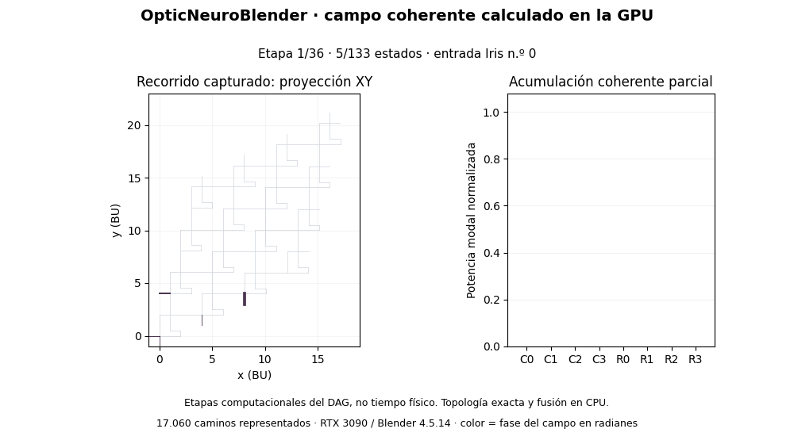
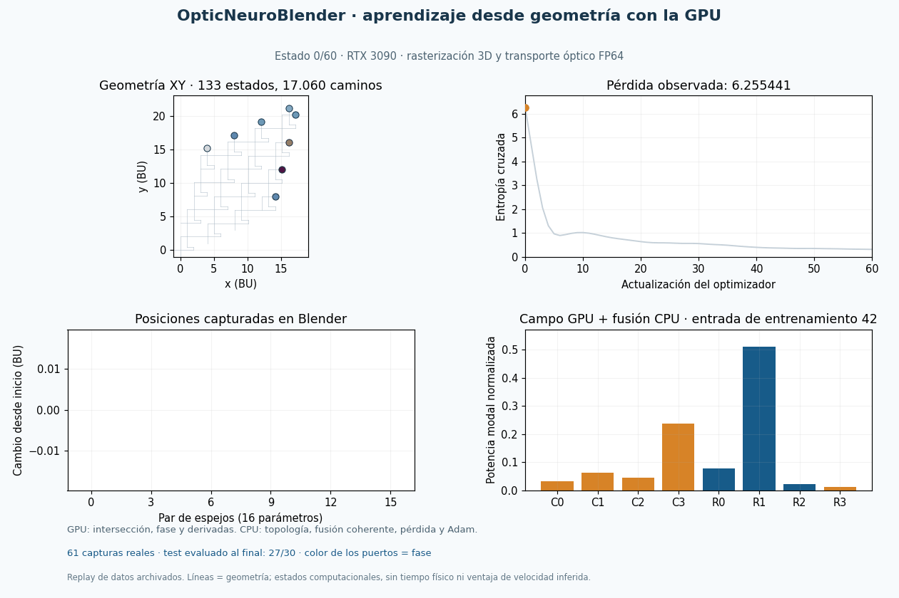
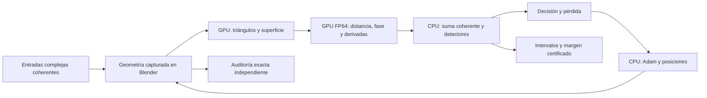
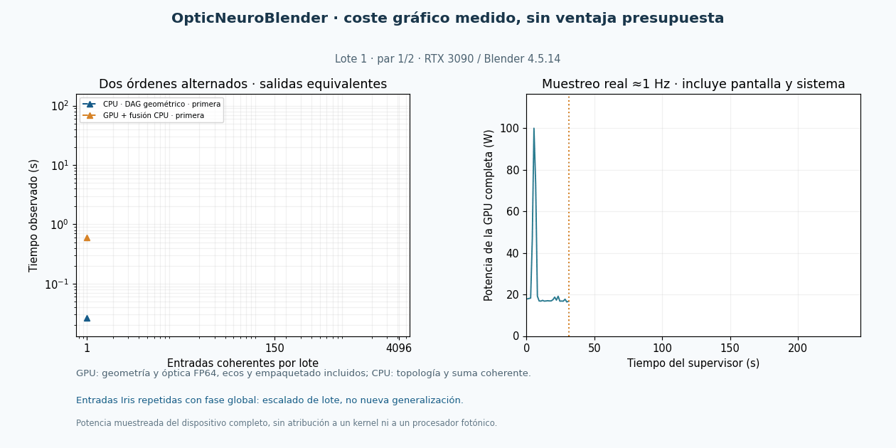
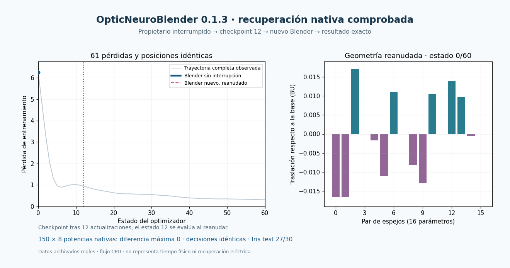

# OpticNeuroBlender · Neuro3D

Red óptica escalar entrenable que calcula desde la **geometría evaluada de Blender**: entradas complejas coherentes, propagación, detectores y decisiones. Blender-Lab es el instrumento computacional de investigación.

**El motor gráfico ya participa en el aprendizaje:** la RTX 3090 selecciona triángulos capturados y calcula distancia, fase y derivadas ópticas en shaders FP64. La topología exacta, las fusiones coherentes, la pérdida y Adam se calculan en CPU. Todos los resultados, protocolos, código y fallos se publican en `main`, conservando las versiones anteriores.

[Instalar y usar](Docs/OPTIC_NEURO_BLENDER_USER_GUIDE_2026-10-09.md) · [Complemento 0.1.3](Blender/releases/optic-neuro-blender-0.1.3.zip) · [Artículo PDF](Docs/paper/optic_neuro_blender_reproducible_draft_2026-10-09.pdf) · [Fuentes del artículo](Docs/paper/optic_neuro_blender_reproducible_draft_2026-10-09.md) · [Estado de los diez objetivos](Docs/SCIENTIFIC_ACCEPTANCE_REPORT_2026-10-09.md)

## Resultados comprobados

| Evidencia | Resultado y alcance |
|---|---|
| Escena capturada | 104 objetos, 6.656 triángulos, cinco fuentes, ocho modos |
| Recorrido completo | 133 estados, 186 aristas, 17.060 caminos; auditor geométrico independiente |
| Aprendizaje en el motor gráfico | 16 parámetros, 60 actualizaciones, 61 capturas reales; nueva escena guardada y reabierta |
| Iris: división fija 120/30 | Pérdida 6.255441 → 0.309707; train 110/120, test **27/30** |
| Control del entrenamiento GPU | Posiciones cuantizadas idénticas a la referencia CPU; 150 decisiones finales iguales |
| Derivadas gráficas | 16 parámetros y 32 perturbaciones del modelo geométrico; controles de diferencias finitas pasan |
| Generalización Wine | Tres semillas: 33/37, 30/37, 28/37; baselines 32/37; sin superioridad demostrada |
| Recuperación instalada 0.1.3 | Interrupción real en checkpoint12; 61 estados y 150 potencias idénticos al baseline, en Windows y Linux externo |

La [certificación independiente del modelo gráfico final](Docs/NATIVE_DEFERRED_TRAINING_FIELD_CERTIFICATE_PROTOCOL_2026-10-09.md) registra cota de campo L1 **9.97e-14** y potencia **7.09e-15** frente al codificador ideal: **150/150 decisiones separadas**, 137 etiquetas correctas y 13 incorrectas. El cumplimiento de los presupuestos fijados es positivo; certificar el cálculo y acertar la clase son resultados distintos.

[Entrenamiento gráfico completo y todos los estados](Docs/NATIVE_DEFERRED_GRAPHICS_TRAINING_PROTOCOL_2026-10-09.md), [derivadas y controles](Docs/NATIVE_GRAPHICS_GEOMETRY_GRADIENT_PROTOCOL_2026-10-09.md), [comparación Wine](Docs/WINE_GENERALIZATION_COMPARISON_2026-10-09.md). Iris ya se había utilizado en el proyecto; este ensayo no es una nueva prueba ciega de generalización.

## Funcionamiento y aprendizaje observados

Una entrada real de Iris: color = fase; barras = acumulación coherente parcial. Las etapas pertenecen al cálculo del grafo y **no representan tiempo físico ni movimiento de fotones**. [Datos y hashes](Docs/assets/verified-animation-manifest-2026-10-09.json).

Replay de los 61 estados reales: posiciones capturadas, pérdida y campos GPU después de la fusión CPU. El test se evalúa al terminar. [Procedencia y hashes](Docs/assets/verified-native-gpu-training-animation-manifest-2026-10-09.json).

La fase relativa cambia la función de la red: sumar intensidades de fuentes independientes elimina interferencias. Las potencias son modales normalizadas; longitud de onda **0,1 BU**, sin calibración física en metros o vatios. El modelo pasivo tiene capacidad cuadrática restringida; no se presenta como aproximador universal.

## Aceleración gráfica y coste completo

| Tecnología ejecutada | Resultado medido |
|---|---|
| Rasterización instanciada + shaders FP64 | Superficies, campo coherente y gradientes desde triángulos; aprendizaje completo validado |
| Sombreado diferido con candidatos GPU | Campos y Jacobianos idénticos al control directo; estado equivalente 42,974 s frente a 38,273 s, sin mejora |
| Cycles OptiX sobre RTX 3090 | Grafo completo y decisiones iguales a la referencia; candidatos + prueba 41,008 s frente a BVH CPU 10,331 s |
| CUDA complex128 como referencia adicional | Inferencia, gradientes y aprendizaje propios comprobados; no demuestra ventaja global |

La supervisión del aprendizaje gráfico completo cuesta **3066.60 s**, incluyendo capturas, prueba geométrica y referencia CPU; RSS propio máximo 499.45 MiB. Las fases del coste permanecen en el [resultado completo](Docs/validation/native-deferred-training-2026-10-09/attempt01/worker/result.json). Los ensayos anteriores cancelados y los resultados negativos están conservados.

[Escalado nativo por lotes y datos completos](Docs/NATIVE_GRAPHICS_SCALING_PROTOCOL_2026-10-09.md): dos órdenes CPU/GPU alternados para cada tamaño, con campos, potencias y decisiones equivalentes. Las entradas repetidas miden coste; no son datos nuevos de generalización.

| Entradas | CPU: primera / segunda (s) | GPU + fusión CPU: fría / caliente (s) |
|---|---|---|
| 1 | 0.0268 / 0.0209 | 0.5929 / 0.3353 |
| 150 | 0.0202 / 0.0319 | 4.0279 / 3.4584 |
| 4096 | 0.0243 / 0.0264 | 98.0069 / 97.7203 |

[Hashes y procedencia del GIF](Docs/assets/verified-native-scaling-animation-manifest-2026-10-09.json). La potencia muestreada incluye toda la GPU y la pantalla; no mide aisladamente un kernel ni eficiencia fotónica.

[Selección técnica y límites de hardware](Docs/ADVANCED_GRAPHICS_TECHNOLOGY_SELECTION_2026-10-09.md), [OptiX real](Docs/NATIVE_CYCLES_OPTIX_COMPONENT_V2_PROTOCOL_2026-10-09.md), [comparación directa/diferida](Docs/NATIVE_DEFERRED_GRAPHICS_STATE_PROTOCOL_2026-10-09.md). SER, Vulkan e HIP/AMD no se etiquetan como ejecutados por disponer de una API o documentación.

La [auditoría de paquetes y lecturas](Docs/NATIVE_PACKET_WORKLOAD_PROTOCOL_2026-10-09.md) reconcilia 5.834 lotes con los registros gráficos. Un candidato de empaquetado produce los mismos 5.650 paquetes ópticos byte por byte y mejora la preparación para 150/4096 entradas; empeora el caso de una entrada. Son mediciones locales en CPU, sin integración GPU ni mejora global demostrada.

## Instalación, recuperación y reproducción

Usa **Blender 4.5.14 LTS**, instala el ZIP 0.1.3 y abre el panel **OpticNeuro**. El paquete contiene el modelo propio, el ejemplo, datos y manifiesto; usa Python y NumPy incluidos en Blender. [Guía paso a paso](Docs/OPTIC_NEURO_BLENDER_USER_GUIDE_2026-10-09.md).

El complemento distribuido utiliza **CPU**. La ruta gráfica validada es un ejecutor científico separado, con hardware, fuentes, recursos y protocolos congelados. La integración de esa ruta en la interfaz aún está pendiente. Cada reproducción científica debe comprobar los hashes y el perfil correspondiente; no sustituir fuentes históricas silenciosamente.

El Blender propietario se interrumpe en checkpoint12; un Blender nuevo reanuda con prueba de la familia geométrica y replay exacto. El trabajador huérfano se detiene solo. [Windows: todos los controles](Docs/INSTALLED_BLENDER_HOST_RECOVERY_PROTOCOL_2026-10-09.md), [Linux externo: instalación limpia y recuperación](Docs/EXTERNAL_INSTALLED_BLENDER_RECOVERY_PROTOCOL_2026-10-09.md), [hashes del GIF](Docs/assets/verified-recovery-animation-manifest-2026-10-09.json). No establece recuperación tras pérdida de alimentación ni interrupciones repetidas de un trabajo ya reanudado.

## Límites científicos y trabajo pendiente

- Hardware AMD real y reproducción gráfica en otro entorno; integración GPU en la interfaz distribuida.
- Familias geométricas, datasets y pruebas ciegas más amplias; comparaciones y energía aislada del proceso.
- Cotas de incertidumbre más allá del modelo representado: transformaciones nativas, medidas y todos los gradientes.
- Fidelidad de la red completa frente a un modelo de ondas; calibración y mediciones si se afirma un dispositivo físico.
- Reproducción e interpretación por investigadores independientes y crítica especializada del artículo.
- Registro externo/IPFS: ruta conservada, **sin identificadores emitidos**. Los protocolos ejecutados usaron autorización GitHub publicada.
- La novedad excepcional, importancia e impacto duradero requieren evidencia adicional. No están demostrados por estos ensayos.

El [paquete de revisión externa](Docs/EXTERNAL_REVIEW_PACKET_2026-10-09.md) fija las comprobaciones y criterios de rechazo para futuros revisores; está preparado y no enviado. La fabricación es opcional para el simulador. El artículo es un borrador reproducible, sin envío a revista ni revisión especializada. Una cota numérica, un test de software y un acierto neuronal son evidencias diferentes.

## Evidencia, licencias e historia

[Checkpoint científico público](Docs/SEQUENTIAL_RESEARCH_PROGRESS_2026-10-08.md) · [Aceptación por objetivo](Docs/research/optic_neuro_blender_acceptance_v1.json) · [Revisión de antecedentes](Docs/LITERATURE_AND_NOVELTY_AUDIT_2026-10-08.md) · [Técnicas externas y licencias](Docs/OPTIC_NEURO_BLENDER_COMPONENT_SELECTION_2026-10-08.md) · [Recibo de compilación del artículo](Docs/paper/scientific_article_build_receipt_2026-10-09.json)

Las portadas [original de main](Docs/HISTORICAL_MAIN_README_BEFORE_INTEGRATION_2026-10-09.md) y [científica anterior](Docs/HISTORICAL_SCIENTIFIC_README_BEFORE_FINAL_PUBLICATION_2026-10-09.md), versiones previas, protocolos y fallos se conservan. La [animación histórica del entrenamiento CPU](Docs/assets/native-blender-geometry-training-2026-10-09.gif) mantiene su procedencia original. Código propio bajo [MIT](LICENSE); atribuciones y licencias de datos en los protocolos. [Historia de la PR6](https://github.com/Agnuxo1/Neuro3D/pull/6). [Política de diff de registros crudos](Docs/RAW_EVIDENCE_DIFF_POLICY_2026-10-09.md).
