# Neuro3D

## Progreso científico — 8 de octubre de 2026

Los resultados nuevos están publicados en la [rama de investigación](https://github.com/Agnuxo1/Neuro3D/tree/codex/neuro3d-scientific-closure-20261008) y la [PR #6](https://github.com/Agnuxo1/Neuro3D/pull/6). Consulta el [README actualizado con esquemas, gráficas y GIF](https://github.com/Agnuxo1/Neuro3D/blob/codex/neuro3d-scientific-closure-20261008/README.md) y el [estado de cada punto](https://github.com/Agnuxo1/Neuro3D/blob/061526413a9e42f97c8405a765bac870b3db49be/Docs/SEQUENTIAL_RESEARCH_PROGRESS_2026-10-08.md).

**Prioridad de nuestro proyecto:** [OpticNeuroBlender](https://github.com/Agnuxo1/Neuro3D/blob/061526413a9e42f97c8405a765bac870b3db49be/Docs/OPTIC_NEURO_BLENDER_COMPONENT_SELECTION_2026-10-08.md), nuestro propio sistema neuronal óptico dentro de Blender. Se seleccionan técnicas de BlenderPhotonics para mallas/modelos y de Blender Optics Simulator para física y referencias; el núcleo neuronal y su validación permanecen en Neuro3D. La evaluación identifica diferencias de coherencia, detector, tolerancias y alcance GPU que deben adaptarse. No se han medido nuevas mejoras de precisión, rapidez, eficiencia o acierto.

**Objetivo concretado:** [Blender-Lab como laboratorio abierto y accesible](https://github.com/Agnuxo1/Neuro3D/blob/487b18ceedc0bc0bc56daa6a1e7101148ecb7742/Docs/BLENDER_LAB_RESEARCH_INSTRUMENT_2026-10-08.md), con Neuro3D como demostrador de red óptica que calcula desde la escena. Se han definido su arquitectura y criterios de validación; la distribución y el trazador completo siguen pendientes. [Cuatro antecedentes directos en Blender](https://github.com/Agnuxo1/Neuro3D/blob/487b18ceedc0bc0bc56daa6a1e7101148ecb7742/Docs/BLENDER_LAB_ANTECEDENTS_2026-10-08.md) orientan la comparación.

**Mejora implementada:** [captura real y contratos neuronales interoperables](https://github.com/Agnuxo1/Neuro3D/blob/58fbe579ccc13eca6d014c8b499c6724460a50e6/Docs/BLENDER_LAB_REUSE_AND_CAPTURE_2026-10-08.md). Se registran mallas evaluadas y parámetros sin añadir redondeo decimal: once pruebas unitarias PASS, controles de software en Blender y captura de la escena Iris con 462 objetos. Cinco entradas, 32 direcciones geométricas de espejos y tres detectores se vinculan sobre la captura. El adaptador de Blender Optics Simulator es opcional; no se declara validado el addon completo ni un nuevo resultado de entrenamiento o propagación óptica.

**Reanudación verificada:** [entrada óptica desde la captura y corrección de abanicos](https://github.com/Agnuxo1/Neuro3D/blob/f22e7a1307e3a3b4c74a507463a0a8055d45fc04/Docs/CAPTURED_SCALAR_INGRESS_AND_FAN_COVERAGE_2026-10-08.md). Se preparan 104 elementos/6.656 triángulos; un auditor independiente verifica 20.280 coordenadas. El selector CPU reconoce como interior el centro compartido por 64 triángulos de `c00.bs1`, conservando bordes y huecos. Pasan 13 controles de entrada, ocho de unión y 17 tests históricos. Captura+contrato y negativas de bibliotecas también se ejecutaron en Blender. El [piloto de propagación](https://github.com/Agnuxo1/Neuro3D/blob/f22e7a1307e3a3b4c74a507463a0a8055d45fc04/Docs/validation/captured-scalar-ingress-2026-10-08/pilot_protocol_prepared.json) está preparado, pendiente de registro; no hay nuevas salidas ópticas, entrenamiento ni GPU de Iris.

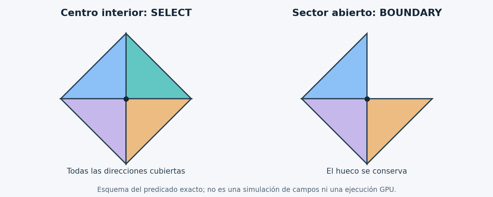

El diagrama ilustra un predicado geométrico, sin representar campos ópticos.

- [Aportación falsable formulada](https://github.com/Agnuxo1/Neuro3D/blob/487b18ceedc0bc0bc56daa6a1e7101148ecb7742/Docs/CONTRIBUTION_AND_FALSIFICATION_2026-10-08.md), con criterio de refutación y dominio explícito.
- [Revisión crítica de antecedentes](https://github.com/Agnuxo1/Neuro3D/blob/487b18ceedc0bc0bc56daa6a1e7101148ecb7742/Docs/LITERATURE_AND_NOVELTY_AUDIT_2026-10-08.md): 194 registros brutos, 175 únicos y extracción de 30 fuentes. La novedad sigue sin demostrar.
- [Cotas racionales de los resultados GPU archivados](https://github.com/Agnuxo1/Neuro3D/blob/f10d74dff3525a317aa89504395aa8a120bc8f3f/Docs/IRIS_RETROSPECTIVE_RATIONAL_CERTIFICATE_2026-10-08.md): error de campo ≤1.282e-13 y 450 decisiones certificadas frente al modelo algebraico canónico. Es un análisis retrospectivo CPU de datos existentes, sin nuevo ensayo GPU ni certificado de recorrido de triángulos.

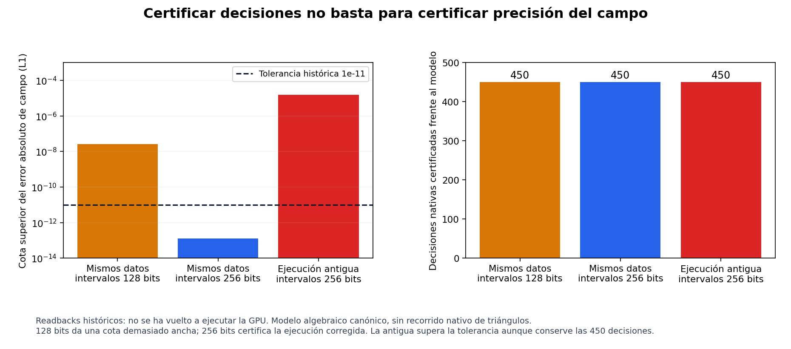

**Blender es la plataforma principal; Unreal queda como referencia histórica.** RT coherente desde geometría real, AMD real y generalización siguen pendientes. La fabricación fotónica es una línea opcional, independiente de validar el instrumento computacional. La formulación y estas cotas no acreditan una ventaja sobre CNN/GPT ni calidad Nobel.

El resto de esta portada conserva la documentación del corte de código de `main`; los avances y límites actuales se consultan en los enlaces anteriores.


> Arquitectura experimental en la que la geometría 3D y las propiedades ópticas de la escena determinan la propagación y transformación de señales entre neuronas. La apariencia visual es secundaria al cómputo.


La [propagación coherente en el motor gráfico 3D](Docs/NATIVE_GRAPHICS_COHERENT_FIELD_PROTOCOL_2026-10-09.md)
ya se ha ejecutado en Blender y RTX 3090: el fragment shader selecciona superficies
capturadas y calcula distancia, fase y campos complejos, sin recibir una matriz de
transferencia precomputada. **150 decisiones iguales**, diferencia máxima de campo
**7,51×10⁻¹⁴**, con controles reales de fase e interferencia. La [certificación racional independiente](Docs/NATIVE_GRAPHICS_FIELD_CERTIFICATE_PROTOCOL_2026-10-09.md)
cubre las 450 salidas observadas y sus decisiones: cota de campo ≤9,98×10⁻¹⁴. La admisión geométrica
exacta y la fusión coherente siguen en CPU. No demuestra ventaja de velocidad,
fidelidad física ni ejecución AMD.

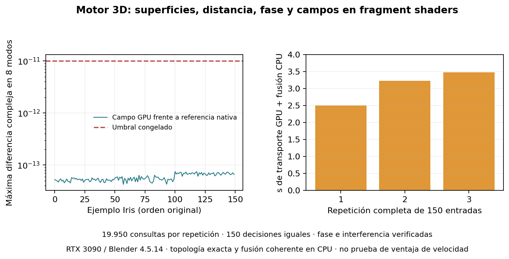

## Estado consolidado

**Prioridad reafirmada:** OpticNeuroBlender será nuestro sistema propio de red
neuronal óptica funcional dentro de Blender. Las técnicas de
[BlenderPhotonics y Blender Optics Simulator](Docs/OPTIC_NEURO_BLENDER_COMPONENT_SELECTION_2026-10-08.md)
se seleccionan para mejorar sus mallas, física, propagación y coste de cálculo.
La reutilización debe conservar las entradas, la coherencia, los parámetros
entrenables y los detectores de Neuro3D. Las mejoras de velocidad, precisión y
eficiencia deberán demostrarse con comparaciones equivalentes.

**Objetivo concretado por el propietario:** desarrollar
[Blender-Lab](Docs/BLENDER_LAB_RESEARCH_INSTRUMENT_2026-10-08.md), un laboratorio
abierto y accesible para investigar física óptica, con Neuro3D como demostrador
de red neuronal que calcula a partir de la escena. La distribución y el trazador
coherente completo siguen en desarrollo; sus resultados deberán ser cuantitativos,
verificables y reproducibles. El instrumento computacional tiene criterios de
éxito propios, independientemente de fabricar un procesador fotónico.

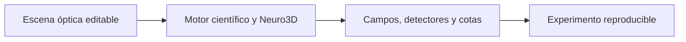
```mermaid
flowchart LR
  E[Escena óptica editable] --> M[Motor científico y Neuro3D]
  M --> V[Campos, detectores y cotas]
  V --> R[Experimento reproducible]
```

El esquema representa la arquitectura objetivo de Blender-Lab.

La agenda científica del 8 de octubre utiliza Blender como laboratorio principal;
Unreal queda como referencia histórica por decisión del propietario.
Consulta [los cierres y su alcance](Docs/SCIENTIFIC_CLOSURE_STATUS_2026-10-08.md),
el [plan completo](Docs/BLENDER_SCIENTIFIC_ROADMAP_2026-10-08.md) y la
[nueva secuencia de investigación](Docs/SEQUENTIAL_RESEARCH_PROGRESS_2026-10-08.md).

## Pregunta científica y progreso verificable

La [reproducción CPU en un entorno Linux de GitHub](Docs/EXTERNAL_CPU_REPRODUCTION_PROTOCOL_2026-10-09.md)
pasa los 34 controles, el certificado racional y las 61 auditorías del entrenamiento.
Reproduce **150/150 decisiones y 27/30 aciertos**, con diferencia máxima de
potencia `3,89×10⁻¹⁶`; el ejecutor científico tarda 367,37 s. La réplica por
investigadores independientes sigue pendiente. La [instalación nativa Blender Linux](Docs/EXTERNAL_NATIVE_BLENDER_PROTOCOL_2026-10-09.md) también
pasa sus nueve controles: entrenamiento real con 61 auditorías y 27/30 aciertos,
recuperación, copia/reapertura y log de salida sin errores. Coste completo 685,77 s;
preparación 21,09 s y controles nativos 663,69 s; diferencias de potencia con Windows≤3,89×10⁻¹⁶.

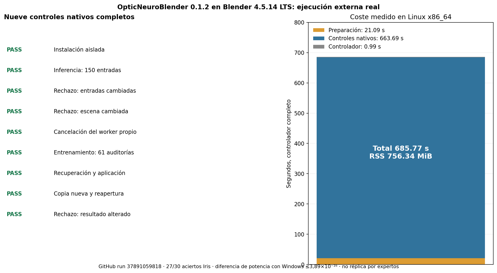

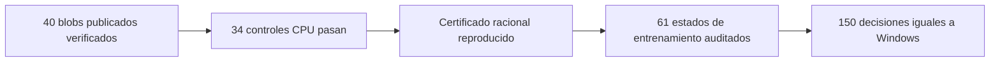
```mermaid
flowchart LR
  F[40 blobs publicados verificados] --> C[34 controles CPU pasan]
  C --> I[Certificado racional reproducido]
  I --> T[61 estados de entrenamiento auditados]
  T --> D[150 decisiones iguales a Windows]
```


El [recorrido coherente de la captura real](Docs/COHERENT_STATE_GRAPH_AND_GRADIENTS_2026-10-09.md)
ya devuelve `COMPLETE`: **133 estados exactos, 186 aristas y 17.060 caminos
terminales representados**, con las 104 superficies alcanzadas desde cinco fuentes.
El auditor separado verifica primeros hits y cobertura de ramas no nulas.
La [certificación secundaria independiente](Docs/OBSERVED_GRAPH_OUTPUT_CERTIFICATION_2026-10-09.md)
acota las ocho salidas nativas observadas frente al modelo representado: error
de campo L1 ≤ `4,94×10⁻¹⁵` y de potencia ≤ `3,14×10⁻¹⁵`, con presupuesto
previo `10⁻¹¹`. Certifica R1 para el estímulo unitario, con margen ≥ `0,189336`.
La [auditoría de vecindades interiores](Docs/INDEPENDENT_SURFACE_NEIGHBORHOOD_AUDIT_2026-10-09.md)
también pasa independientemente en los 133 estados. El entrenamiento propio
dispone del ensayo acotado descrito debajo; todavía faltan generalización más
amplia y fidelidad física. El nuevo perfil conserva los dos ensayos inconclusos.

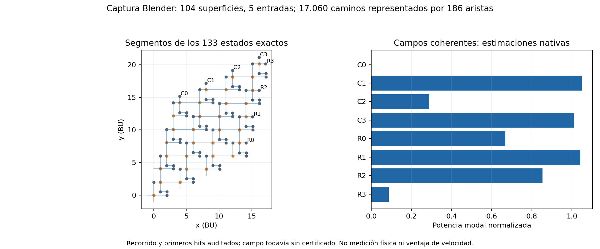

El [primer entrenamiento propio desde la captura](Docs/CAPTURED_GEOMETRY_TRAINING_PROTOCOL_2026-10-09.md)
también pasa: 16 traslaciones de parejas de espejos, 60 actualizaciones y 61
estados geométricos auditados independientemente. Se borraron los retardos
históricos antes del ensayo. La pérdida bajó de 6,26 a 0,31; el último estado
acierta 110/120 filas de entrenamiento y 27/30 reservadas. Iris ya fue utilizado
en el proyecto; la comparación posterior con Wine amplía la evaluación pública.

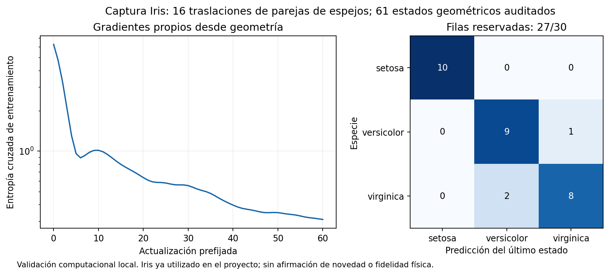

La [certificación independiente de las 150 salidas nativas](Docs/NATIVE_TRAINING_BATCH_CERTIFICATION_2026-10-09.md)
incluye la aritmética del codificador: campo ≤`2,77×10⁻¹⁵`, potencia ≤`1,04×10⁻¹⁵`,
y 150 argmax separados. **137 decisiones son correctas y 13 equivocadas**.
La geometría pretendida y la discrepancia física continúan sin cotas.

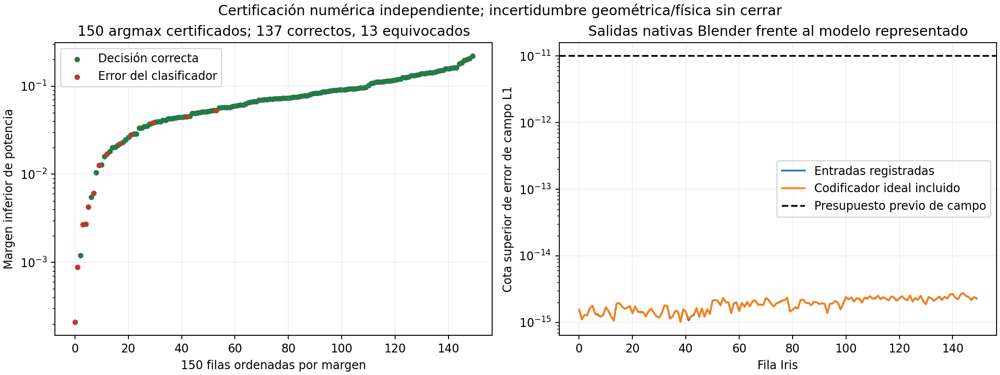

La [estabilidad geométrica condicional](Docs/CONDITIONAL_PARAMETER_BOX_PROTOCOL_2026-10-09.md)
prueba la topología en cuatro intervalos continuos de las 16 parejas. Certifica
147/150, 131/150, 40/150 y 0/150 decisiones constantes al ampliar los intervalos;
conserva todos los desconocidos. Es una familia virtual representada, con
incertidumbre de la canalización nativa general y física todavía abierta.

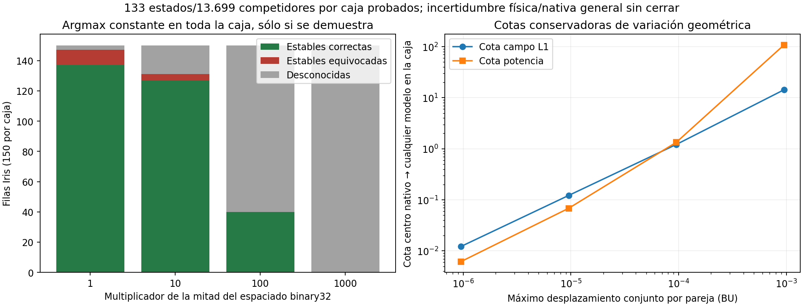

La [reproducción nativa en Blender](Docs/TRAINED_GEOMETRY_BLENDER_REPRODUCTION_2026-10-09.md)
también pasa: guardar, reabrir y recapturar el [archivo entrenado nuevo](Docs/validation/trained-geometry-blender-reproduction-2026-10-09/attempt01/worker/trained_geometry.blend)
conserva la geometría admitida y reproduce las 150 predicciones. El archivo
original se mantiene. Es una reproducción local; no una réplica externa.

La [ejecución real NVIDIA del grafo entrenado](Docs/TRAINED_GRAPH_NVIDIA_BENCHMARK_2026-10-09.md)
verifica campos, potencias y gradientes propios en la RTX 3090. Una referencia
racional independiente acota las salidas CUDA de 60 entradas: campo L1
≤ `2,94×10⁻¹⁵`, potencia ≤ `1,39×10⁻¹⁵`; 59 decisiones certificadas y la
entrada nula indeterminada. Los tiempos muestran CUDA más lento en lotes
pequeños y más rápido para 2.048 entradas, con un baseline matricial equivalente
todavía más eficiente para geometría fija. AMD real sigue pendiente.

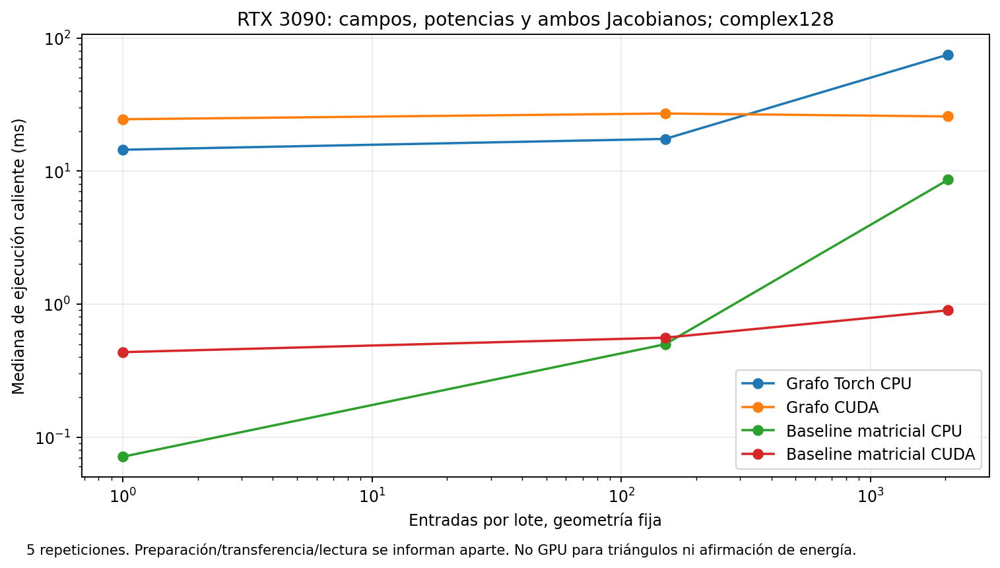

El [entrenamiento ya se recupera de una interrupción real de su worker](Docs/TRAINING_PROCESS_RECOVERY_PROTOCOL_2026-10-09.md):
checkpoint atómico tras 12 actualizaciones, nuevo proceso, prueba geométrica nueva y
reproducción determinista del prefijo antes de restaurar Adam. Los 61 estados y pérdidas,
y las 150 potencias y decisiones, coinciden exactamente con la ejecución sin interrupción.
Se rechazan cuatro checkpoints adversos. La interfaz instalada y la caída del host Blender
requieren controles adicionales.

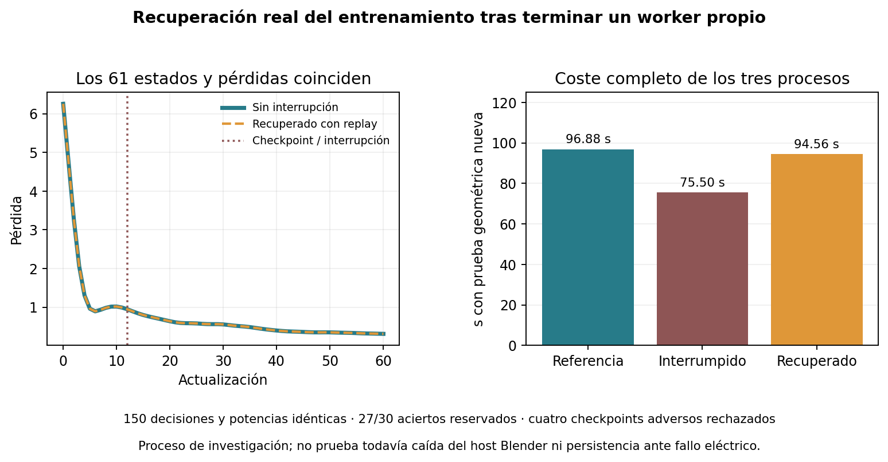

El [nuevo refinamiento exacto de la ruta gráfica](Docs/NATIVE_GRAPHICS_FRONTIER_PROTOCOL_2026-10-09.md)
reduce la construcción observada a **10,45–10,60 s**, frente a **29,81–30,04 s**
de la CPU original, manteniendo los 133 estados, los 17.060 caminos y las 150 decisiones.
La [ablación con idéntica verificación](Docs/NATIVE_GEOMETRY_ENGINE_ABLATION_PROTOCOL_2026-10-09.md)
ya ejecutada da **9,83–9,90 s en BVH nativo CPU** y **9,91–10,00 s en raster GPU**.
No demuestra ventaja global de GPU en esta escena: la mejora anterior combina
la sustitución del motor y una verificación geométrica más eficiente.

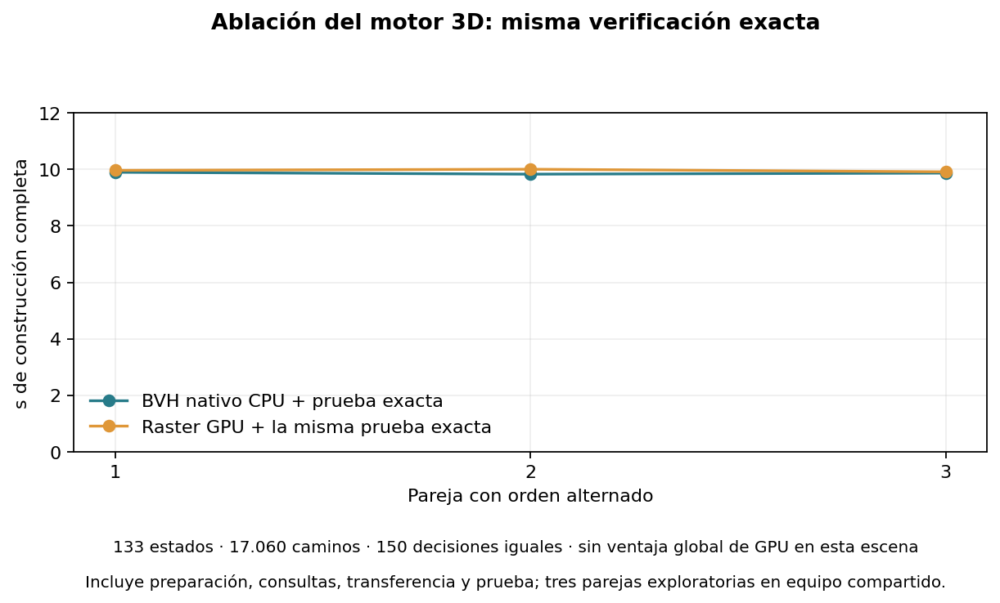

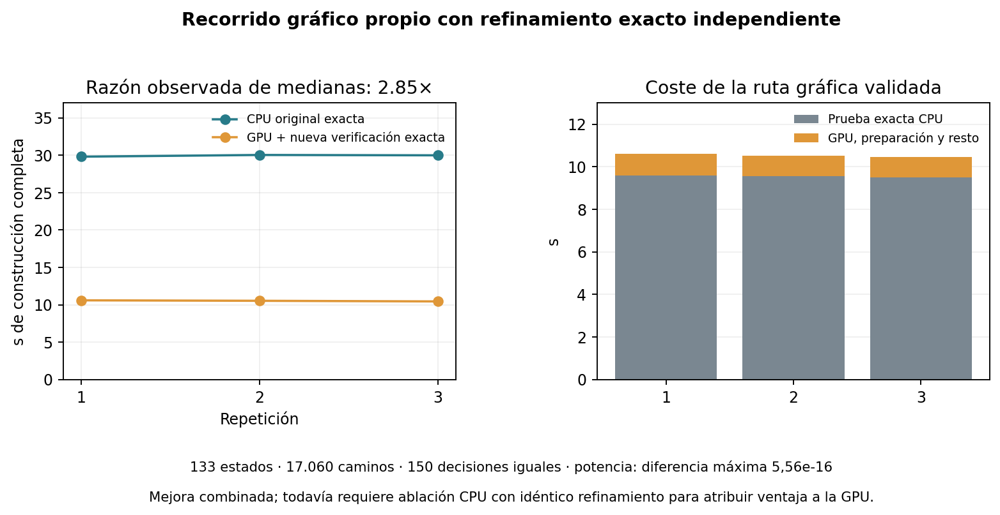

El [recorrido autónomo con GPU gráfica](Docs/NATIVE_GRAPHICS_FRONTIER_PROTOCOL_2026-10-09.md)
parte de las cinco fuentes y reproduce **133 estados, 186 conexiones y 17.060 caminos**,
con los 133 candidatos verificados exactamente y las 150 decisiones originales iguales.
Diferencia máxima de potencia 5,56×10⁻¹⁶. Construcción completa CPU 29,87–30,77 s
frente a GPU gráfica + comprobación exacta 31,53–33,01 s: sin aceleración global en esa primera versión.
La fase se conserva mediante longitudes racionales refinadas; el coste dominante es verificar
los contactos de los triángulos.

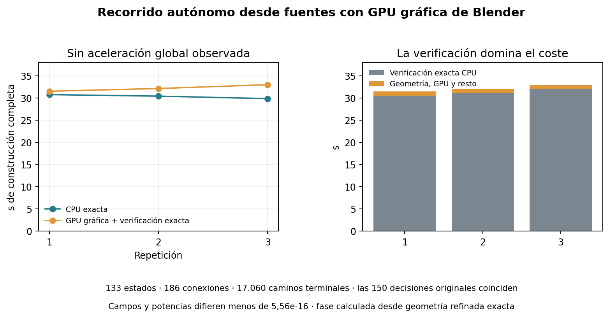

La [GPU gráfica de Blender ya selecciona superficies reales](Docs/NATIVE_GRAPHICS_GEOMETRY_PROTOCOL_2026-10-09.md):
6.656 triángulos, los 133 rayos correctos en cinco repeticiones y 3,26–5,66 ms por lote con lectura incluida.
El control de planos separados por 2⁻²⁵ unidades falla y queda registrado; la selección FP32
requiere verificación exacta antes de propagar fase. Este es un componente geométrico,
con recorrido autónomo validado por separado; no demuestra aceleración completa.

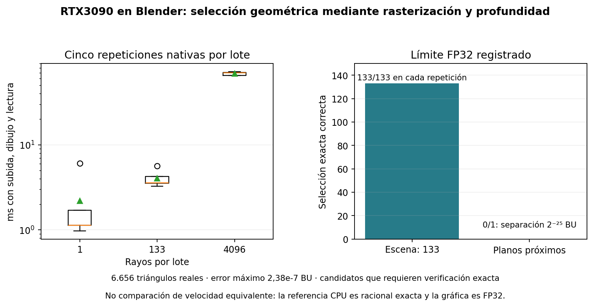

El [entrenamiento propio con CUDA](Docs/GEOMETRY_CUDA_TRAINING_PROTOCOL_2026-10-09.md)
completa las 60 actualizaciones y 61 auditorías, con 27/30 aciertos y las 150 decisiones
iguales a CPU. Las geometrías finales coinciden; diferencia máxima de potencia
3,89×10⁻¹⁶ y de gradiente en cada estado 2,85×10⁻¹³. El coste completo observado
es **370,46 s CPU frente a 390,09 s CUDA**: no hay aceleración global en esta pareja.
El coste dominante sigue siendo auditar geometría en CPU; AMD y energía siguen pendientes.

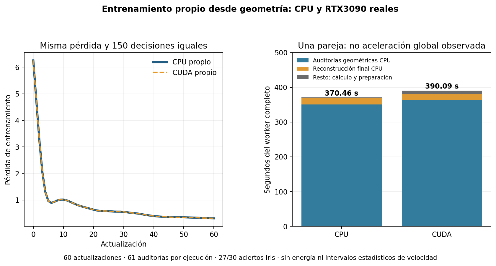

La [evaluación prospectiva en Wine](Docs/WINE_GENERALIZATION_COMPARISON_2026-10-09.md)
añade tres inicializaciones fijadas y 183 estados geométricos auditados. Aciertan
33/37, 30/37 y 28/37 filas reservadas; los baselines lineal y cuadrático, con las
mismas cuatro variables y codificación, aciertan 32/37. Se publican todas las
semillas, incertidumbre y coste, sin seleccionar por la evaluación. El resultado
muestra aprendizaje y sensibilidad a la inicialización; no demuestra superioridad
óptica ni transferencia sin reentrenar.

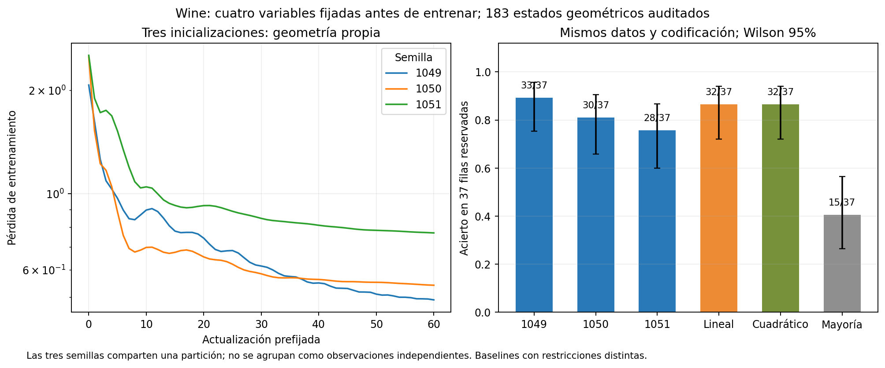

El [contraste ondulatorio gaussiano independiente](Docs/GAUSSIAN_WAVE_REFERENCE_PROTOCOL_2026-10-09.md)
conserva un resultado negativo: 36 casos ejecutados, con fallo de campo en
λ=0,1 BU / z=4 BU para ventana 16 BU. Refinar la malla no elimina el error;
ampliar la ventana lo reduce. La referencia continua y la aproximación paraxial
se distinguen. Este control caracteriza una familia escalar declarada; la
fidelidad física de la red completa sigue pendiente.

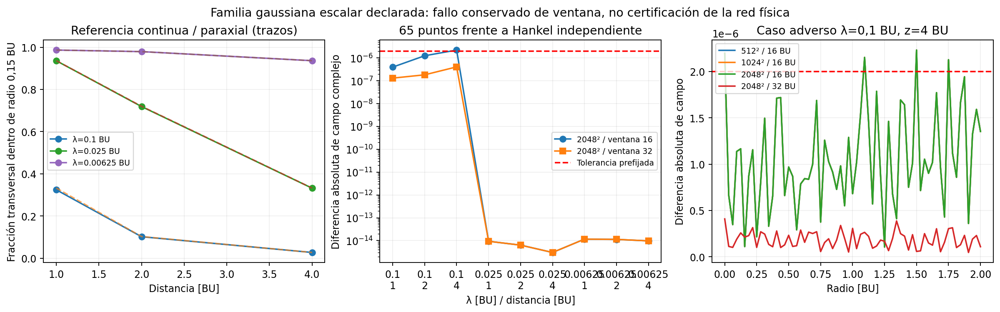

El [ensayo adaptativo de mayor ventana](Docs/GAUSSIAN_WAVE_REMEDIAL_PROTOCOL_2026-10-09.md),
publicado antes de ejecutar y con las mismas tolerancias, satisface las puertas de sus nueve pares λ/z.
La diferencia máxima de campo observada baja a 9,29×10⁻⁸ con ventana de 64 BU;
coste completo 133,05 s y RSS máximo 1866,79 MiB. Se conserva el fallo anterior y el error de apertura de las mallas gruesas.
Esto caracteriza una familia gaussiana escalar declarada; la fidelidad física de la red completa sigue pendiente.

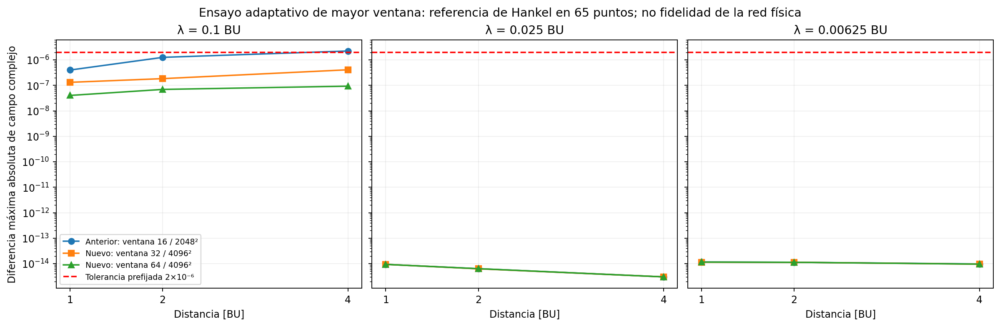

El [complemento propio instalable](Docs/OWN_BLENDER_ADDON_PROTOCOL_2026-10-09.md)
supera nueve controles reales en Blender: instalación aislada, inferencia, entrenamiento geométrico propio dentro de Blender,
cancelación, rechazo de resultados obsoletos, recuperación y copia/reapertura. Reproduce los 27/30 aciertos Iris y las 150 potencias
con diferencia observada cero; coste completo 729,01 s. El fallo histórico de doble desregistro está conservado y corregido en [0.1.2](Docs/OWN_ADDON_LIFECYCLE_PROTOCOL_2026-10-09.md), con cinco controles nativos y salida sin errores.

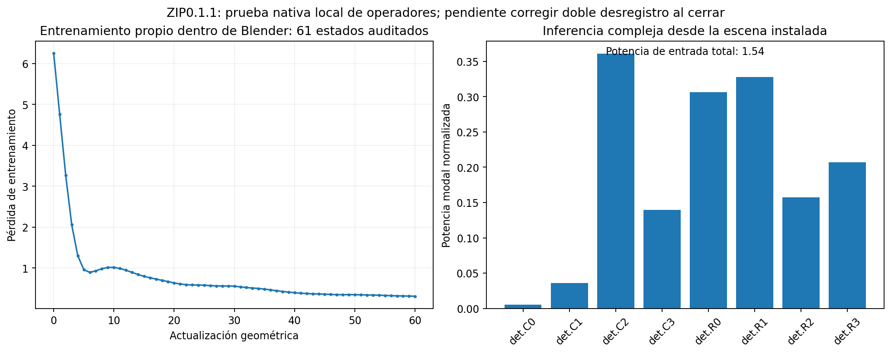

El [borrador científico reproducible](Docs/paper/optic_neuro_blender_reproducible_draft_2026-10-09.md)
reúne métodos, datos, costes, resultados negativos y límites. La revisión externa, la fidelidad física completa,
la validación AMD y una aportación original de importancia excepcional siguen pendientes.

El [ejecutor y auditor del piloto](Docs/CAPTURED_PILOT_SUPERVISOR_2026-10-08.md)
están preparados con fuentes/inputs fijados, límites de recursos y negativa por
registro ausente. Pasan 66 controles conjuntos de software. El piloto se ejecutó
**con resultado inconcluso**: el límite original de 90 segundos interrumpió el
worker antes de producir un resultado. El propietario ha [autorizado el protocolo congelado en GitHub](Docs/PILOT_REGISTRATION_DUAL_ROUTE_2026-10-09.md)
y mantiene la vía externa/IPFS adicional; no hay registro externo emitido todavía.
El [primer intento autorizado](Docs/CAPTURED_PILOT_EXECUTION_2026-10-09.md)
verificó todos los hashes pero no inició el cálculo: 3.652 MiB libres frente al
umbral fijo de 4.000 MiB. El segundo inició el cálculo y agotó 90 segundos;
la métrica permanece nula. Ambos recibos y las fuentes exactas están archivados.

La [selección espacial exacta](Docs/EXACT_OBJECT_INDEX_2026-10-09.md) añade cajas
racionales conservadoras por objeto. Pasan 74 controles de software, incluidos
160 consultas comparadas con el selector exhaustivo. El recorrido completo de
la captura se completó después mediante el grafo; el coste equivalente de esta
optimización aislada todavía no está caracterizado.
El [perfil posterior separado](Docs/INDEXED_CAPTURE_PROFILE_2026-10-09.md),
autorizado antes de ejecutarse, también agotó 90 segundos y conserva métrica nula.
La autorización humana cubre la secuencia de futuros perfiles fijados y publicados
antes de sus ensayos; el registro externo/IPFS permanece pendiente.

El [diagnóstico corto de la captura](Docs/CAPTURED_PATH_DIAGNOSTIC_2026-10-09.md)
recogió 16 consultas y un resultado incompleto válido en 2,72 s: 4.736 candidatos
frente a 106.496 oportunidades exhaustivas. Conserva nueve límites de recursos
y campos nulos. Es un diagnóstico, no inferencia neuronal ni una ventaja de tiempo demostrada.

El [contrato coherente ejecutable](Docs/OPTIC_NEURO_BLENDER_COHERENT_CONTRACT_2026-10-08.md)
fija unidades, portadora/referencia común, fases, parámetros y potencia modal.
Pasan 50 controles CPU y la admisión dentro de Blender del `.blend` Iris real:
104 superficies, 6.656 triángulos, cinco entradas y tres detectores. Guardar/reabrir
conserva la identidad de la fixture. Son controles de admisión; la propagación completa
y el entrenamiento desde esta captura siguen pendientes.

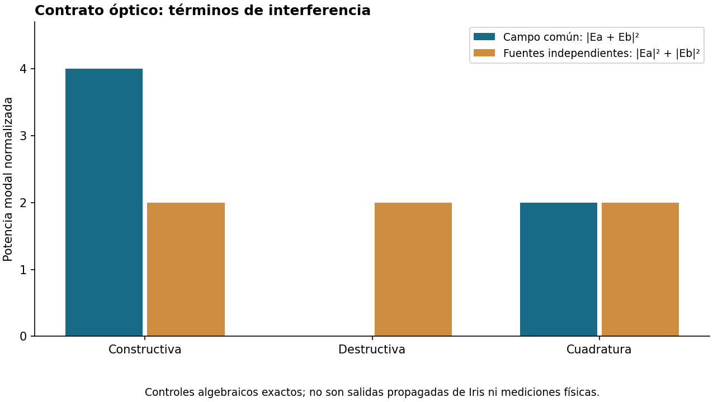

La [contribución operativa y el contraste dirigido de novedad](Docs/OPTIC_NEURO_BLENDER_OPERATIONAL_CONTRIBUTION_2026-10-08.md)
fijan cuatro obligaciones: identidad de escena, caminos completos, inclusión del
campo y decisión derivada de sus cotas. La revisión añade OptiBench como antecedente
de laboratorio coherente. El resultado sigue siendo **novedad no establecida**.
Los [criterios de las diez prioridades actuales](Docs/research/optic_neuro_blender_acceptance_v1.json)
conservan los resultados históricos y explicitan lo que falta medir.

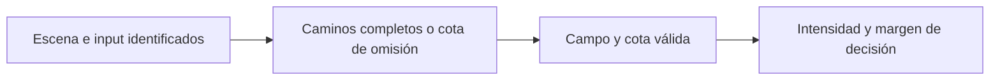
```mermaid
flowchart LR
  Q[Escena e input identificados] --> P[Caminos completos o cota de omisión]
  P --> F[Campo y cota válida]
  F --> D[Intensidad y margen de decisión]
```

Este diagrama representa obligaciones de validación; la cadena completa aún no está cerrada.


Se ha [formulado la aportación candidata](Docs/CONTRIBUTION_AND_FALSIFICATION_2026-10-08.md):
transporte coherente desde geometría real con certificados de error utilizables.
Un certificado falso verificado refutaría la hipótesis; rechazar todos los casos
no demostraría utilidad. La novedad y la ejecución RT completa permanecen pendientes.
El esquema muestra el método propuesto, no un resultado experimental.

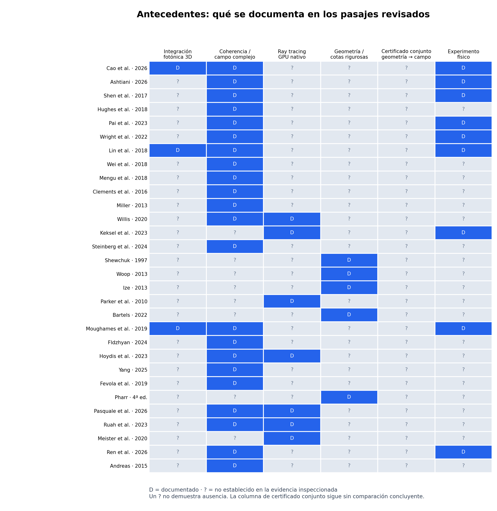

La [revisión de antecedentes](Docs/LITERATURE_AND_NOVELTY_AUDIT_2026-10-08.md)
ha registrado 194 resultados brutos, 175 únicos y una extracción de 30 fuentes.
Los ingredientes tienen antecedentes; la novedad de un certificado conjunto aún
no está demostrada. La figura marca con `?` lo no establecido en los pasajes
inspeccionados, sin afirmar ausencia en la literatura. Quedan candidatos por revisar.

Se añade un [pase específico de antecedentes Blender-Lab](Docs/BLENDER_LAB_ANTECEDENTS_2026-10-08.md):
BlenderPhotonics, Blender Optics Simulator, OptiCore y simulación científica SFDI
en Blender. Las nuevas fuentes se registran por separado del mapa histórico de 30;
son comparadores pertinentes, sin afirmar que sus capacidades hayan sido reproducidas aquí.

Se ha incorporado un [módulo de captura e interoperabilidad](Docs/BLENDER_LAB_REUSE_AND_CAPTURE_2026-10-08.md)
para registrar mallas evaluadas, unidades, propiedades ópticas y las direcciones de
entradas, parámetros y detectores de Neuro3D. Conserva los valores representados
sin añadir redondeo decimal y ofrece un adaptador opcional para Blender Optics
Simulator. La captura tiene controles de software; la integración con el cálculo
neuronal óptico completo continúa pendiente.

La [conexión con el formato del motor escalar](Docs/CAPTURED_SCALAR_INGRESS_AND_FAN_COVERAGE_2026-10-08.md)
ya prepara 104 elementos ópticos y 6.656 triángulos de la captura Iris, con
transformación afín racional y auditoría independiente de 20.280 coordenadas.
Se corrigió también el falso borde en los centros de abanicos triangulados,
conservando huecos y bordes reales. Esta etapa prepara entradas y comprueba el
selector CPU; no publica nuevos campos, entrenamiento ni resultados GPU de Iris.


El esquema ilustra el predicado geométrico exacto, sin representar campos ópticos.

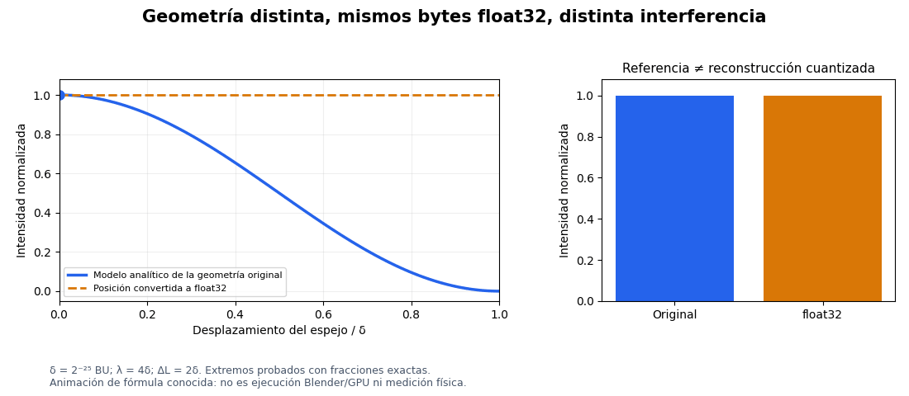

Un [testigo CPU exacto](Docs/QUANTIZATION_INFORMATION_LOSS_WITNESS_2026-10-08.md)
muestra cómo dos geometrías originales pueden tener los mismos bytes float32 y
distinta interferencia. El GIF es una ilustración analítica, no una ejecución
Blender/GPU ni medición física. No se reivindica como principio nuevo; distingue
error de representación y corrección del modelo representado.

El [análisis algebraico de Iris](Docs/IRIS_LINEAR_FIELD_QUADRATIC_DECISION_2026-10-08.md)
deriva fronteras de decisión cuadráticas para la red congelada, con 81 testigos
racionales exactos de una identidad conocida. No acredita nuevos datos de test
ni profundidad no lineal. Sirve para definir el baseline de cálculo equivalente.


El [análisis retrospectivo con intervalos racionales](Docs/IRIS_RETROSPECTIVE_RATIONAL_CERTIFICATE_2026-10-08.md)
acota el error de los campos archivados de Iris en ≤1.282e-13 y certifica 450 decisiones
frente al modelo canónico. El control antiguo conserva esas decisiones pero viola
la precisión de campo: coincidir en clases no basta. Este análisis CPU reutiliza
datos GPU históricos; no es un nuevo ensayo ni certifica recorrido de triángulos.

El [puente al plano racional archivado](Docs/PLANNED_GEOMETRY_RETROSPECTIVE_LINKAGE_2026-10-08.md)
comprueba su topología exacta y acota la diferencia de fase debida a π representado.
Al combinarlo con los readbacks históricos, el campo queda en ≤1.304e-13 y las
450 decisiones siguen certificadas para ese plano. La captura real Blender y
el recorrido nativo de triángulos permanecen pendientes.

Los cierres anteriores incluyen 20 consultas first-hit GPU, referencia multicamino
CPU exacta/certificada y el circuito Iris completo en GPU con 450 acuerdos con
la referencia independiente. Los 450 acuerdos no son 450 clasificaciones correctas;
el test histórico conserva 29/30. No acreditan recorrido completo de triángulos RT,
generalización nueva, ventaja energética ni un dispositivo fotónico físico.

## Consolidación histórica

La integración del 6 de octubre reúne los avances locales del motor y las
correcciones públicas de Iris. Consulta el [estado técnico y sus límites](Docs/PROJECT_STATUS_2026-10-06.md)
y el [recibo de consolidación](Docs/validation/consolidation-2026-10-06.json).

## Qué es

Neuro3D explora una red neuronal digital donde posición, orientación y respuesta
óptica de los objetos determinan la información que recibe cada neurona. El
primer circuito usa óptica geométrica simulada en CPU y mide intensidad, color,
frecuencia y fase. La ambición posterior es escalarlo y aprovechar la GPU, sin
confundir este prototipo con hardware fotónico real o un solucionador de Maxwell.

## Demostrador ejecutable dentro de Blender


Abre [Neuro3D_Render_Network.blend](Blender/render_network_demo/Neuro3D_Render_Network.blend)
en Blender 4.5 y pulsa **F12**. Sus nodos de material calculan interferencia,
fotodetección y activación durante el render EEVEE; Python no suma campos durante
esa inferencia. Las posiciones X de los codificadores y las propiedades de escena
controlan fase, longitud de onda, potencia y umbral. Cuatro copias de una neurona
coherente mínima muestran XOR, con una presentación lista para inspeccionar.

Es un **modelo digital ideal de shader con offsets simbólicos**, no una red
entrenada general, trazado geométrico de esos haces ni computación óptica física.
Los drivers suministran parámetros desde CPU y el render sigue haciendo aritmética.
No hay ventaja de velocidad o eficiencia demostrada. Pruebas por readback EXR,
instrucciones y límites en [la guía del demostrador](Blender/render_network_demo/README.md).

## Rutas de implementación

La reconstrucción actual contiene:

- **Oracle CPU**: referencia determinista, reproducible y ejecutable sin GPU.
- **Blender**: gates híbridos de raycast y campos, más el demostrador EEVEE
  ejecutado en GPU. La vista previa CPU y el contrato GPU antiguo se conservan.
- **Unreal Engine histórico**: plugin `SantoGrialPhotonic` con ciclo RDG y compute
  shaders preservado; su compilación no está acreditada y ya no es requisito.

## Vista de arquitectura


En el nuevo circuito Blender, los objetos de la escena son la fuente de verdad:
sus transformaciones y propiedades ópticas alimentan el trazado, y el resultado
se escribe en el receptor. Lee [la arquitectura óptica](Docs/BLENDER_ARCHITECTURE.md)
para las ecuaciones, el alcance físico y los límites actuales.

## Cómo viaja una señal


Cada arista tiene origen, destino, peso y retardo. La señal conserva una fase y una
frecuencia, transporta color RGB y pierde amplitud mediante atenuación. La
acumulación coherente modifica la activación, energía, fase y color del nodo destino.

## Validación


La GPU no se considera validada por compilar un shader: debe producir un readback
comparable con el oracle CPU, con error por campo, checksum y métricas de latencia.

## Inicio rápido sin ocupar la GPU

Desde la raíz del repositorio:

```powershell
python Blender/tests/test_photonic_model.py
python Blender/tests/test_scene_optics.py
python Blender/tests/test_static_contract.py
```

Estas pruebas no importan `bpy`, no inicializan un contexto GPU, no lanzan Blender y
no ejecutan shaders.

## Versión Blender

Consulta [Blender/README.md](Blender/README.md) y el [plan completo de pruebas](Docs/BLENDER_TEST_PLAN.md).

El addon original sigue siendo un circuito CPU; la demo EEVEE anterior es una
ruta separada, ahora ejecutada y verificada. El addon crea
un circuito de tres objetos y calcula un pulso óptico con un rayo reflejado en
CPU. El circuito se ejecutó realmente en Blender 4.5.14 LTS en background, se
guardó y se reabrió con el mismo estado. Consulta el
[informe de ejecución](Docs/BLENDER_RUNTIME_REPORT.md). La antigua vista previa
visual se conserva aparte. El shader experimental está en
`Blender/shaders/nebula_photonic_compute.glsl`.

Las validaciones posteriores de una celda y una malla de 16 interferómetros
(8 modos) superaron gates locales híbridos: Blender determina geometría y
longitudes por raycast, mientras Python suma los campos complejos. El fallo
histórico de referencia de fase y el primer fixture multicelda fallido se
conservan en el historial, sin convertirlos retrospectivamente en éxitos.
Consulta [la auditoría independiente de EXP-004 conf1](Docs/EXP-004-CONF1-INDEPENDENT-AUDIT-2026-09-29.md).
Estos gates no validan óptica física ni el transporte geométrico del nuevo shader.

## Versión Unreal Engine histórica

Ruta preservada para trazabilidad; retirada de los requisitos por el propietario.
Las decisiones del plugin descritas debajo pertenecen a esa ruta histórica.

El plugin está en `Plugins/SantoGrialPhotonic`. Implementa una primera rebanada
vertical con:

1. `EmitSignalsCS`.
2. `AccumulateFieldsCS`.
3. `UpdateNeuronsCS`.
4. Readback periódico para checksum y energía.

Lee [las decisiones de reconstrucción](Plugins/SantoGrialPhotonic/Docs/DECISIONS.md)
antes de modificar el pipeline. No se debe añadir OptiX ni convertir Niagara en el
núcleo computacional antes de pasar compilación UE, readback y paridad.

## Versiones antiguas y compatibilidad

Las fuentes y documentos previos se conservan en el árbol existente para mantener
trazabilidad. No se borran ni se presentan como parte validada del nuevo corte. Los
artefactos generados —`Binaries`, `Intermediate`, `Saved`, cachés, binarios y
credenciales— permanecen fuera del release mediante `.gitignore`.

## Estado histórico de este corte

Esta tabla corresponde al código conservado en este corte. El estado actualizado de investigación se encuentra en los enlaces de progreso anteriores.

| Ruta | Estado y alcance |
|---|---|
| Oracle CPU y modelo determinista | Pruebas conservadas; 9 del modelo repetidas en la consolidación |
| Iris híbrido | 117/120 entrenamiento y 29/30 prueba; archivo portátil y reconstrucciones repetidas verificados; [informe](Docs/IRIS_REBUILD_VALIDATION_2026-10-06.md) |
| Pilotos OpenGL nativos | Evidencia local K3/K4 y nearest V2; alcance geométrico acotado |
| Precisión hi/lo | Verificación CPU; nueva integración nativa pendiente |
| RT coherente completo | Pendiente; piloto geométrico parcial conservado |
| Unreal 5.6 histórico | Compilación/paridad no acreditadas; ya no es requisito |
| Hardware fotónico | Sin medición física establecida |

Los informes y los límites de reproducción están enlazados en el
[estado consolidado](Docs/PROJECT_STATUS_2026-10-06.md). Conservar un informe previo
no significa haber repetido su experimento durante esta integración.

## Investigación y continuidad

La colaboración Codex–Claude–JEV y la agenda actual están documentadas en
[`coordinacion/PROTOCOLO.md`](coordinacion/PROTOCOLO.md) y
[`coordinacion/CHECKPOINT.md`](coordinacion/CHECKPOINT.md).

## Licencia

MIT. Consulta [LICENSE](LICENSE).

La [versión propia 0.1.2](Blender/releases/optic-neuro-blender-0.1.2.zip) cierra el defecto de doble desregistro: [cinco controles reales en Blender](Docs/OWN_ADDON_LIFECYCLE_PROTOCOL_2026-10-09.md) y salida sin errores, con las 150 potencias/predicciones iguales y el núcleo científico intacto.

El [operador completo de cinco entradas y ocho salidas](Docs/NATIVE_OPERATOR_GRAM_PROTOCOL_2026-10-09.md)
tiene rango cinco certificado por LDL con intervalos. Para cualquier entrada compleja,
la variación relativa de norma cuadrada queda acotada por 3.07e-19.
La prueba se refiere al modelo escalar representado y no calibra potencia física.

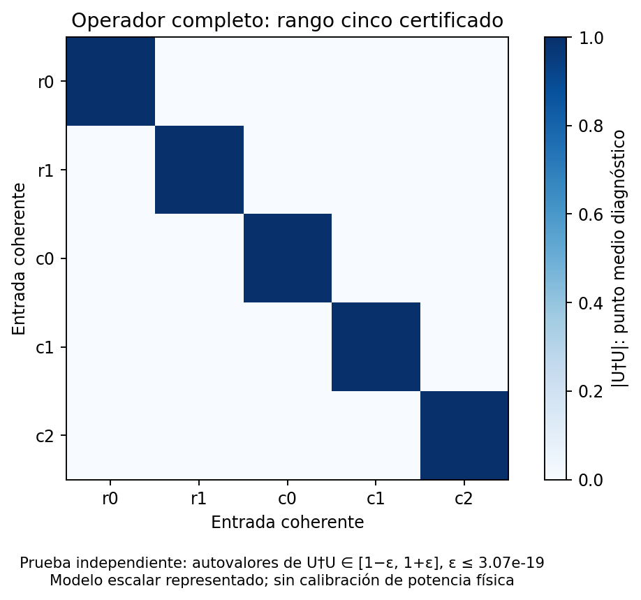

La [optimización con una prueba geométrica continua nueva](Docs/GEOMETRY_REUSE_TRAINING_PROTOCOL_2026-10-09.md)
reduce el coste completo observado de **393,11 s a 90,93 s (4,32×)** en una pareja CPU.
Mantiene exactamente las coordenadas y la pérdida de los 61 estados, las 150 potencias
y decisiones, y 27/30 aciertos. Incluye toda la prueba y reconstrucción; es una pareja,
sin intervalo estadístico de velocidad. El ZIP 0.1.2 conserva su entrenador original.

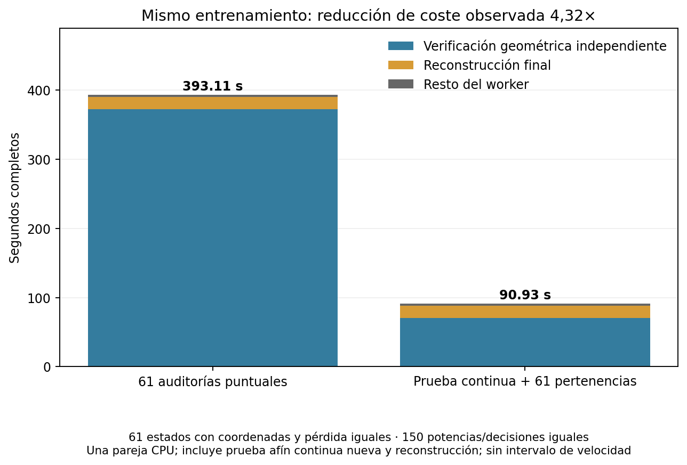

[Guía de instalación y uso](Docs/OPTIC_NEURO_BLENDER_USER_GUIDE_2026-10-09.md) ·
[Paquete de reproducción y crítica especializada pendiente](Docs/EXTERNAL_SPECIALIST_REVIEW_PACKET_2026-10-09.md)
